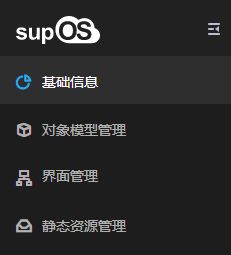

> ## **APP设计器菜单**

---

* [基础信息](/docs/BasicOperation/DesignerMenu/appBaseInfo)
* [界面管理](/docs/BasicOperation/DesignerMenu/appPageDesign)
* [静态资源管理](/docs/BasicOperation/DesignerMenu/appStaticResource)

---

鼠标在工业APP封面悬停，点击“编辑页面”进入工业APP设计界面对工业APP进行组态设计。

- **基础信息**
    
    显示工业APP的基本信息。

- **对象模型管理**
    
    工业APP内的对象模型管理功能与supOS全局对象模型管理功能完全一致，区别为工业APP内的对象模型只应用在工业APP内部，在工业APP导出时自动将内部对象模型导出，工业APP内部调用的全局或其他APP下的对象模型无法同步导出。在工业APP内创建对象模型时勾选其他APP可见，将工业APP内部对象模型共享至全局，其他工业APP可使用该对象模型进行组态。

    *关于对象模型管理请参考[《supOS工厂建模管理软件用户手册V2.4.pdf》](http://oss.supos.com/docs/ProductManual/supOS/V2.8.1/supOS工业APP组态开发软件用户手册V2.4.pdf)*

- **界面管理**
    
    界面设计：界面设计是整个工业APP的核心设计模块，工业APP内的所有页面均需要通过界面设计模块进行组态；

- **静态资源管理**
    
    静态资源管理是存储工业APP组态所需要调用的静态资源，例如图片、视频等，通过静态资源的url地址进行调用；

