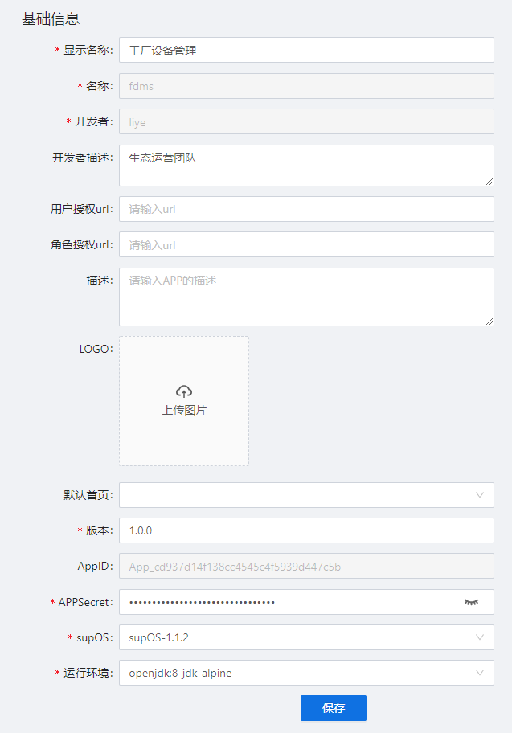

> ## **基础信息**

---

|字段名称|说明|
|:---|:---|
|显示名称|用户定义的工业APP显示的名称，运行期的名称；|
|名称|用户定义的工业APP名称；|
|开发者|APP的开发者；|
|开发者描述|对开发者的描述；|
|用户授权url|输入第三方软件配置用户权限的url地址；|
|角色授权url|输入第三方软件配置角色权限的url地址；|
提示|通过supOS的用户管理及角色管理下新增的工业APP名称的页签配置第三方用户使用工业APP的权限； 配置前需要确保supOS与第三方软件用户及角色需完全一致，配置后才可生效。|
|描述|对工业APP的描述，便于使用者记住其特性；|
|图标|设置工业APP封面图标，便于使用者快速定位；|
|默认页面|设置APP的默认页面，在用户桌面打开APP时显示该页面；|
|版本|工业APP的版本；|
|AppID|自动生成的工业APP ID标识，判断APP的唯一性；|
|AppSecret|自动生成的工业APP密码；|
|supOS|支持使用该APP的最低supOS版本；|
|运行环境|JAVA包的运行环境；|

---

「注意」 
通过supOS的用户管理及角色管理下新增的工业APP名称的页签配置第三方用户使用工业APP的权限； 
配置前需要确保supOS与第三方软件用户及角色需完全一致，配置后才可生效。

---

