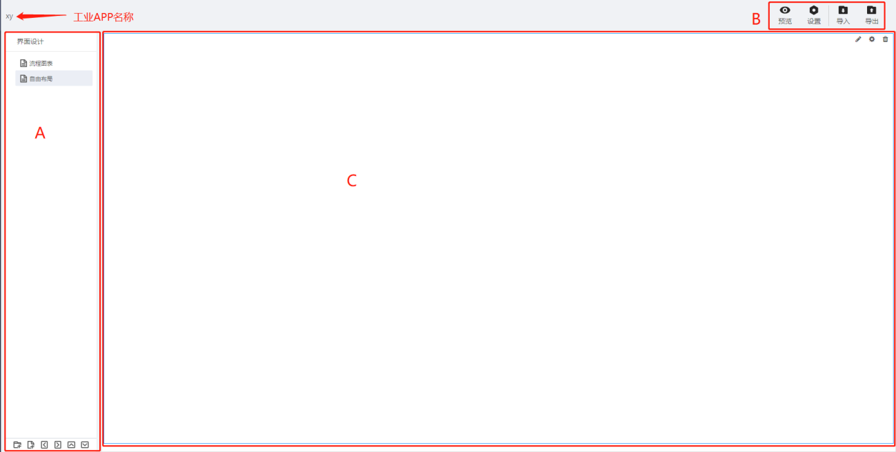

> ## **界面设计**

---

**界面设计说明详见：[界面设计器说明](https://supos-project.github.io/supOS-Object-Documents/#/docs/CommonIntro/interfaceDesigner)**

- 点击「界面管理 - 界面设计」菜单，进入页面设计界面，界面分成三部分，包括：
  - A区域：页面菜单;
  - B区域：页面设计操作栏;
  - C区域：页面；

