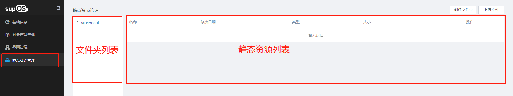
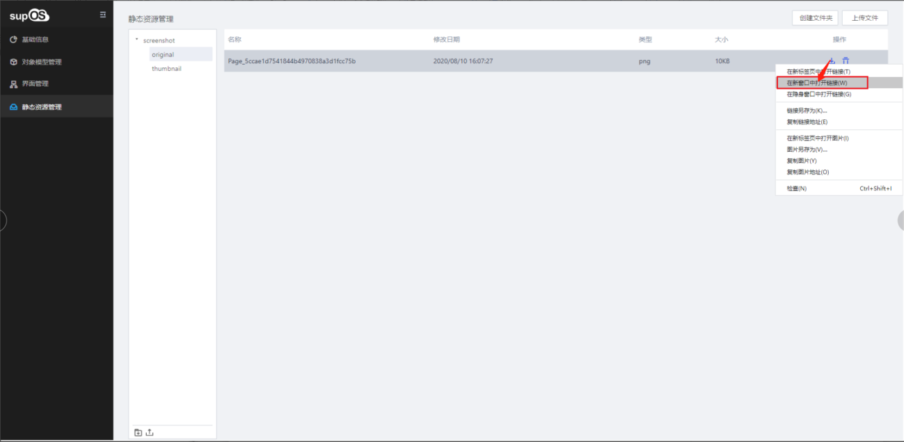
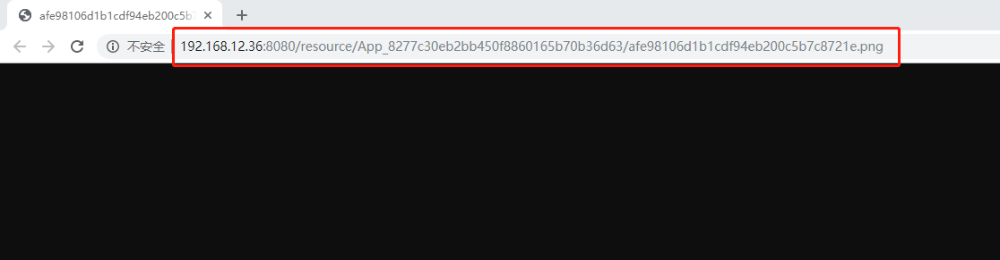
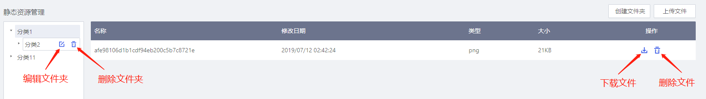

> ## **静态资源管理**

---

**点击静态资源管理菜单，界面显示文件夹列表以及对应静态资源列表。**

---

> ### **查看静态资源地址**

---

---

> ### **基础操作**

---

- **创建文件夹**
  - 点击<创建文件夹>，在文件夹列表中新增一个文件夹；
- **上传文件**
  - 选择一个文件夹，点击<上传文件>，选择你要上传的文件，上传后文件在静态资源列表进行显示；若未选择文件夹，上传文件默认在根目录下；
- **其他操作**
  - 点击编辑文件夹可对文件夹名称进行编辑；点击下载文件，可将静态资源下载到本地；可对文件夹、文件进行删除操作；

---

> ### **调用关系**

---

**在需要调用静态资源文件时时输入静态资源的链接地址，自动调用该文件。**
