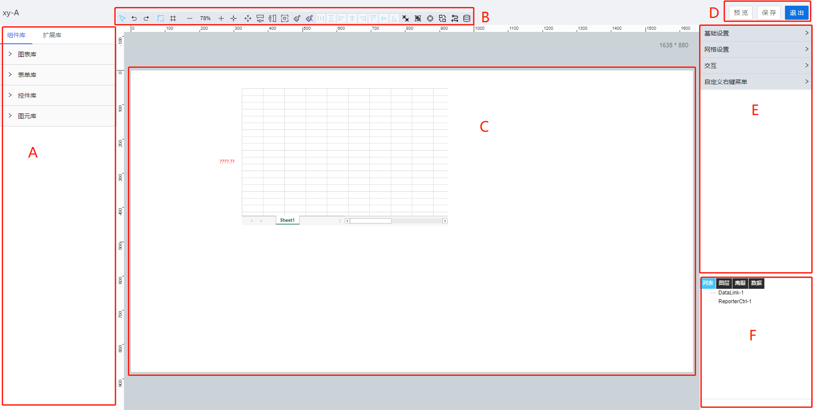

> ## **画布操作域**

---

双击布局块或点击布局块编辑按钮进入画布设计界面。

工业APP组态需要在画布上进行设计，通过拖、拉、拽的方式完成页面的组态，将各类控件进行排版组合、样式设计、绑定数据最终展示给用户，提供了一个功能完备且操作便捷的页面制作环境。

- 画布界面包括：
    - 「**控件库**」（A区域）;
    - 「**画布工具栏**」（B区域）;
    - 「**画布**」（C区域）;
    - 「**操作**」（D区域）;
    - 「**属性栏**」（E区域）;
    - 「**多功能区**」（F区域）;

---

> ### **画布操作**

---

- 在控件库选中控件，在画布上拖拽或单击鼠标画一个控件；
- 空白处按住鼠标拖动画布，控件上按住鼠标拖动控件进行排列；
- 滚轮前后滚动，放大、缩小整个画布比例；
- 按住Ctrl拖拽鼠标选择范围，选中页面内控件；
- 按住Ctrl单击控件可选择多个控件，可对同类型多个控件同时进行属性配置；
- 在画布上选中图元，鼠标放在图元边角，点击可旋转图元；
- 鼠标在图元控件或组合控件上双击，打开动态配置页面，配置动态效果；
- 选中控件鼠标右键菜单;

|命令|功能描述|备注|
|:---:|:---|:----|
|剪切|剪切选中控件||
|拷贝|拷贝选中控件||
|粘贴|粘贴选中控件|只有剪切或拷贝后才会出现粘贴选项|
|移至顶层|将控件移至顶层||
|上移一层|将控件上移一层||
|下移一层|将控件下移一层||
|移至底层|将控件移至底层||
|组合|将1个或多个控件进行组合||
|解组|将已组合的控件进行解组|只有组合后的控件才会出现解组选项|
|动态|配置控件的动态效果|只有图元控件或组合控件才可配置动态|
|另存为模板|将选中的组合控件存为模板|只有组合控件才能存为模板|