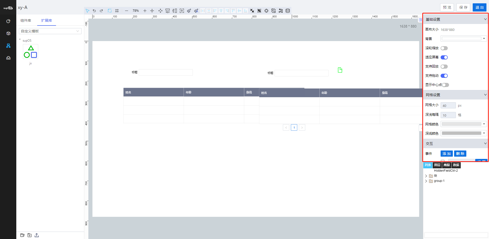
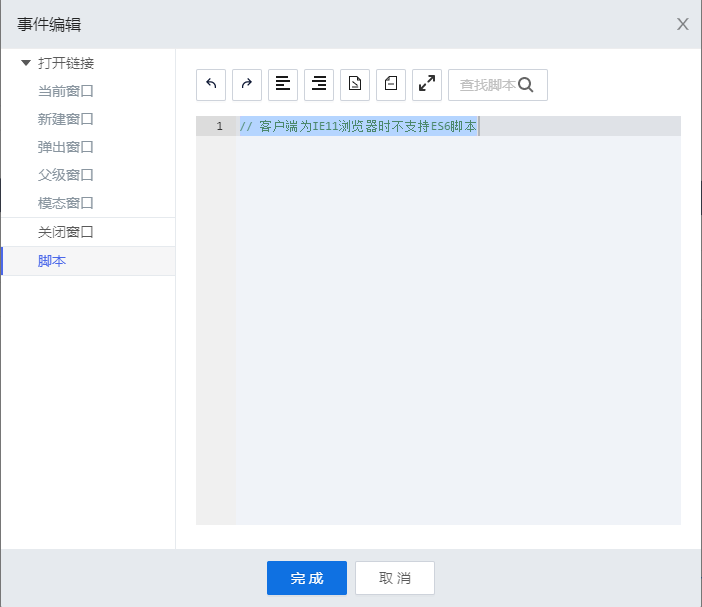
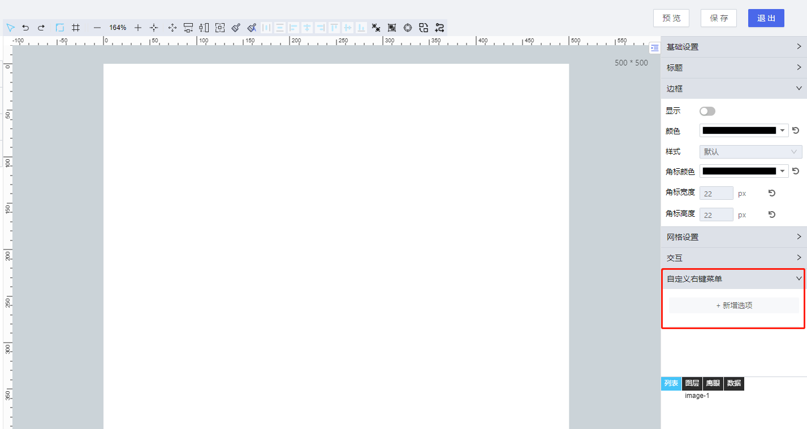
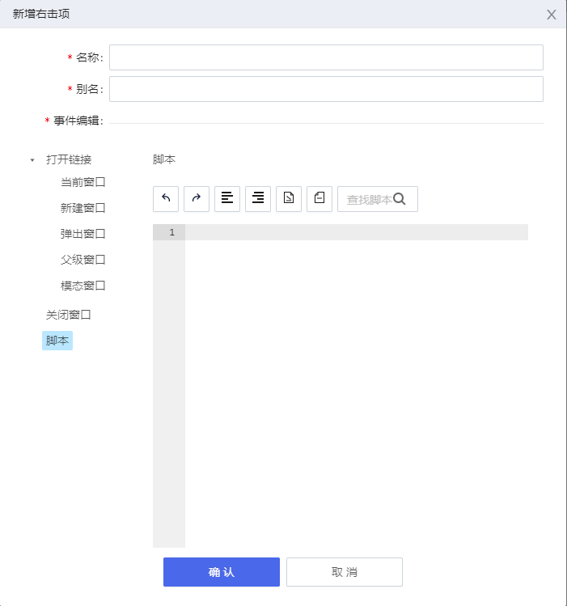

> ## **画布属性栏**

---

未选择画布上任何控件，属性栏显示内容为画布属性；选择控件时，属性栏显示对应控件属性，通过配置属性对控件进行设置。

本章节介绍画布属性的配置说明，控件属性配置说明请参考：[supOS 控件属性说明](https://supos-project.github.io/supOS-Object-Documents/#/docs/FreeDesigner/)

---

> ### **基础设置**

---

---

> ### **网格设置**

---

- 「**网格大小**」：每一格的边长大小；
- 「**深浅每隔**」：每两个深线之间隔几个网格；
- 「**网格颜色**」：网格线的颜色；
- 「**深线颜色**」：深线的颜色；

---

> ### **交互事件**

---

通过交互设置，设置执行的事件，可设置打开的连接或执行脚本等。
- 「**添加**」：添加执行的事件，一个交互可同时执行多个事件；
- 「**删除**」：删除事件，勾选事件复选框，删除选中的事件；
- 「**选择交互**」：点击下拉框，可选择对应的交互；- 页面初始化：页面首次加载初始化时的执行动作；
  - 「**内容改变**」：组件内容改变的时候触发设置的执行动作；
  - 「**内容加载**」：在组件加载的时候触发设置的执行动作；
  - 「**选中**」：选中时触发设置的执行动作；
  - 「**单击**」：单击时触发设置的执行动作；
  - 「**双击**」：双击时触发设置的执行动作；
- 「**设置**」：设置交互执行动作；
- 「**打开链接**」：通过该右键菜单打开一个链接的页面，可设置该页面的打开方式以及内容；
  - 「**当前窗口**」：当前窗口打开选择的链接；
  - 「**新建窗口**」：新建标签页窗口打开选择的链接；
  - 「**弹出窗口**」：弹出窗口打开选择的链接，可设置弹出窗口的宽度、高度以及页面布局；
  - 「**父级窗口**」：在当前窗口的父级窗口打开选择的链接；
  - 「**模态窗口**」：以模态窗口的形式打开选择的链接，模态窗口打开后，原页面锁定可不编辑；
  - 「**关闭窗口**」：关闭窗口；
- 「**脚本**」：脚本编辑器，可自定义配置所需脚本；

---

> ### **自定义右键菜单**

---

通过自定义右键菜单，可以在运行期点击鼠标右键，选择要执行的动作或脚本。一个页面可添加多个右键菜单，图元库控件也可以添加多个右键菜单。

- 选择右侧属性栏里的自定义右键菜单标签，点击新增选项；
- 在弹出窗口中填写“名称”、“别名”以及选中执行动作或脚本，点击「**确认**」；
    - 「**名称**」：运行期右键显示的菜单名称；
    - 「**别名**」：在脚本编写时使用别名进行调用，只允许输入以字母开头，字母数字和_的组合名称；
    - 「**打开链接**」：通过该右键菜单打开一个链接的页面，可设置该页面的打开方式以及内容；
      - 「**当前窗口**」：当前窗口打开选择的链接；
      - 「**新建窗口**」：新建标签页窗口打开选择的链接；
      - 「**弹出窗口**」：弹出窗口打开选择的链接，可设置弹出窗口的宽度、高度以及页面布局；
      - 「**父级窗口**」：在当前窗口的父级窗口打开选择的链接；
      - 「**模态窗口**」：以模态窗口的形式打开选择的链接，模态窗口打开后，原页面锁定可不编辑；
      - 「**关闭窗口**」：关闭窗口；
- 「**脚本**」：脚本编辑器，可自定义配置所需脚本；
- 新增完成可对此右键菜单编辑或删除；
- 完成编辑后可以运行期在页面上点击鼠标右键展示该名称的右键菜单。

