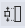
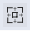

> ## **画布工具栏**

---

---

|图标|含义|功能|
|:---:|:---|:----|
||编辑|取消组件库的控件选中状态，灰色图标表示选中控件状态，蓝色图标表示未选中控件状态|
||撤销|撤销上一步操作|
||重做|恢复撤销操作|
||显示刻度尺|显示/隐藏画布刻度尺，蓝色图标表示显示刻度尺，灰色图标表示隐藏刻度尺|
||显示网格|显示/隐藏画布网格，蓝色图标表示显示网格，灰色图标表示隐藏网格|
||缩小|缩小整个画布比例|
||放大|放大整个画布比例|
||缩放到全屏|整个画布适应区域大小|
||全屏|全屏显示画布区域，按ESC键退出全屏|
||等宽|多个控件宽度调整至相同|
||等高|多个控件高度调整至相同|
||等大小|多个控件的宽度和高度调整至相同|
||格式刷|样式的格式刷，仅用于图元控件，蓝色图标表示使用格式刷，灰色图标表示未使用格式刷|
||动态格式刷|动态效果的格式刷，仅用于图元控件，蓝色图标表示使用动态格式刷，灰色图标表示未使用动态格式刷|
||横向分布|选中三个或三个以上的控件，将所有控件横向等距离分布|
||纵向分布|选中三个或三个以上的控件，将所有控件纵向等距离分布|
||左对齐|选中两个或两个以上的控件，将所有控件靠左对齐|
||水平居中|选中两个或两个以上的控件，将所有控件水平居中对齐|
||右对齐|选中两个或两个以上的控件，将所有控件靠右对齐|
||顶端对齐|选中两个或两个以上的控件，将所有控件顶端对齐|
||垂直居中|选中两个或两个以上的控件，将所有控件垂直居中对齐|
||底端对齐|选中两个或两个以上的控件，将所有控件底端对齐|
||取消组合|将已组合的控件进行解组|
||组合|将1个或多个控件进行组合|
||检查位号|检查当前页面所有位号的连接状态|
||查找替换|对页面中的所有文字（包括绑定数据源的文字）进行查找替换|
||批量添加Datalink|批量添加多个数据连接控件|
||数据源列表|对页面上关联的动态数据源进行查询，此处不包含图元动态绑定的数据源|