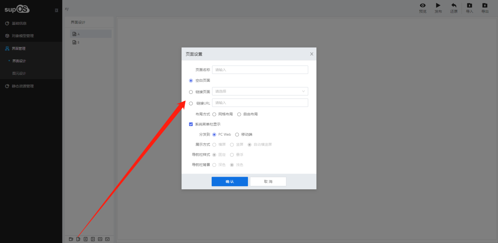

> ## **新建页面**

---

> ### **操作步骤**

---

- 点击「**新建页面**」按钮，弹出页面设置对话框；
- 输入页面名称，选择对应的配置项，点击「**确认**」，新建页面完成。

---

> ### **字段说明**

---

- **空白页面**
  - 页面无内容，用户自行组态；
- **链接页面**
  - 链接到其他工业APP页面，无法对该页面进行编辑，只显示链接页面的内容；
- **链接URL**
  - 输入一个有效的URL地址，页面显示URL对应内容，例如「https://www.supos.com」
- **布局方式**
  - 选择「**自由布局**」，该布局方式仅对当前页面有效；
- **系统菜单栏显示**
  - 勾选后，在系统菜单栏显示该页面；
- **分发到**
  - 选择PC Web，只可在web访问；
  - 选择移动端，可在web和移动端同时访问，移动端可在supOS移动应用平台软件配置相应权限，详细使用说明请参考《supLink移动应用平台软件用户手册》；
- **展示方式**
  - 移动端打开监控画面时默认横屏、竖屏或自动横竖屏；
- **导航栏样式**
  - 移动端监控画面导航栏固定或悬浮；
- **导航栏背景**
  - 设置移动端导航栏背景颜色及字体颜色；