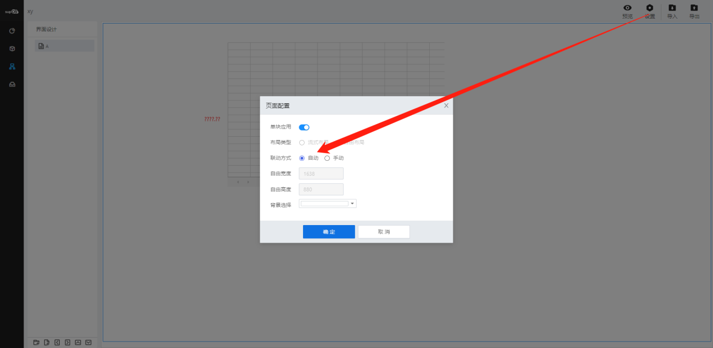
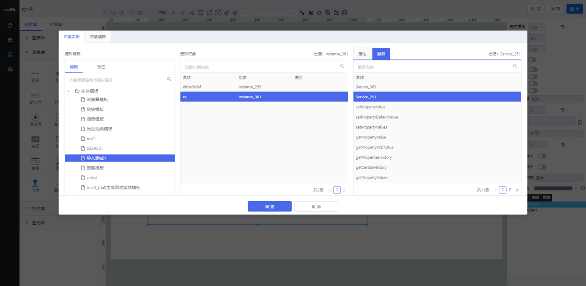
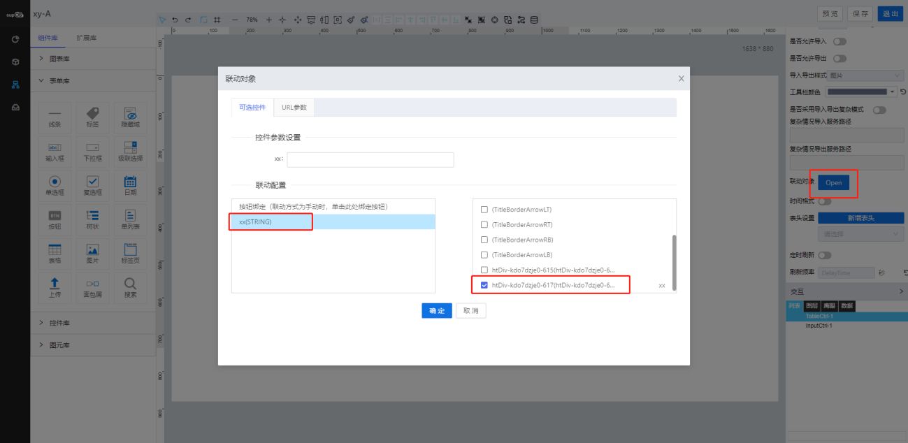
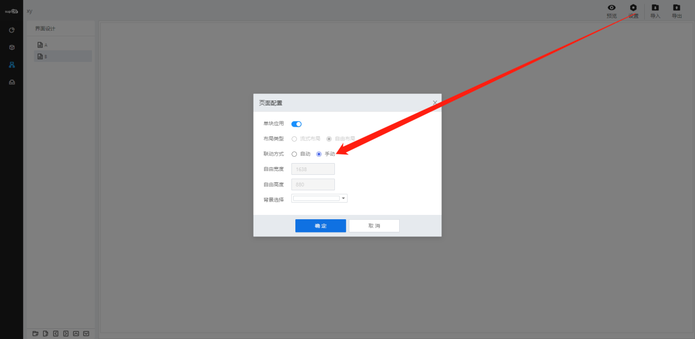
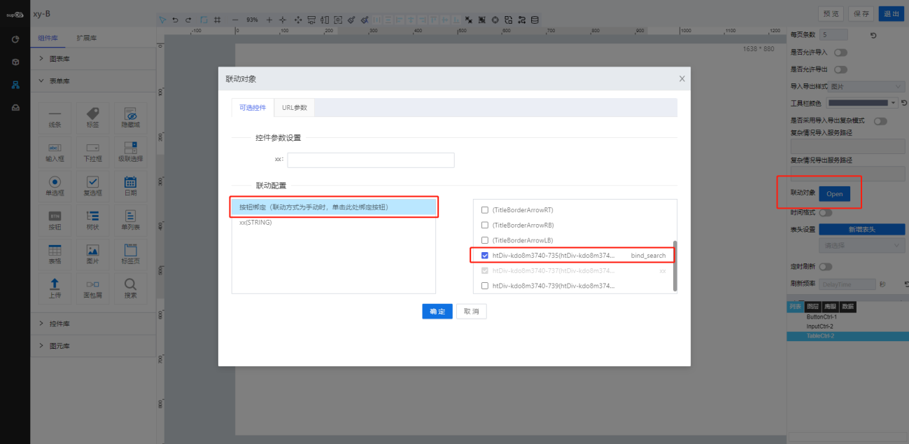

> ## **数据联动**

---

数据联动是用于输入控件与输出控件进行数据请求的一种方式，用户查询服务，历史数据，报表sql等。

- 「**输入控件**」：输入框，时间控件，单选框，多选框，等一系列可输入控件；
- 「**输出控件**」：报表，图表，表格等可接受数据，并进行展示的组件；
- 「**查询方式**」：若数据源绑定object对象实例，每个字段的查询方式可设置“模糊查询”或“精准查询”；若数据源绑定的对象服务或脚本，根据脚本控制查询方式；

---

「注意」 
输入组件名称必须填写； 
绑定的数据源需要设置输入参数； 
手动联动需要绑定按钮，否则无法进行查询； 
联动可进行初始值设置； 

---

> ### **自动联动**

---

    输入控件值改变时，进行数据发送，输出控件直接显示对应数据；

- **操作流程**
  - **新建输入控件，输出控件，填写组件名称（必须）；**
    
  - **点击输出控件，选择数据源；**
    
  - **选中输出控件点击联动对象后的「**open**」按钮，弹出联动对象对话框，可设置初始值、将输入参数与输入控件进行关联；**
    
  - **更改输入控件的值，例如输入“23”，则输出控件中显示code为23的值;**
    

---

> ### **手动联动**

---

    设置联动方式为手动联动，需要通过按钮单击事件触发，否则无法进行查询；

- **操作流程**
  - **需要页面拖入按钮控件，我们设置组件名称为button，用表格对按钮进行绑定，其他操作与自动联动操作一致；**
    
  - **我们输入框改变值为“23”，此时表格不在自动筛选，需要点击按钮才能筛选出；**
    