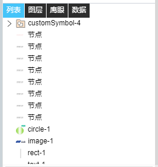

> ## **多功能区域**

---

- 「**列表**」：支持用户通过名称选择需要的控件；
- 「**图层**」：支持拖拽的方式改变各种控件之间的图层关系；
- 「**鹰眼**」：支持用户全局参看所有模块所展示出来的图形效果；
- 「**数据**」：支持用户通过代码的形式对图元控件进行创建、删除、属性修改、动态配置、位置调整等一系列操作。同时用户能够通过保存代码的方式，将绘制的图形进行保存；

