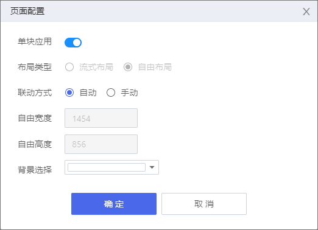

> ## **页面配置**

---

点击页面右上角「**设置**」按钮，弹出「**设页面配置置**」对话框，设置页面布局、联动方式后点击「**确定**」按钮，设置完成。

---

> ### **配置属性**

---

- **单块应用**
  - 控制页面类型，开启状态下为单块布局，关闭状态下为多块布局；
- **布局类型**
  - 页面的布局类型设置，多块布局可设置布局类型为流式布局或自由布局。
- **联动方式**
  - 控件之间的联动设置，多用于输入框或按钮与表单控件之间的联动；
    - **自动联动**：表单控件的值改动会自动触发相应的联动查询；
    - **手动联动**：表单控件值的改动必须通过主动点击按钮的方式来触发相应联动查询；
- **自由宽度**
  - 多块布局/自由布局下设置自由宽度；
- **自由高度**
  - 多块布局/自由布局下设置自由高度；
- **背景选择**
  - 选择布局块的背景颜色；