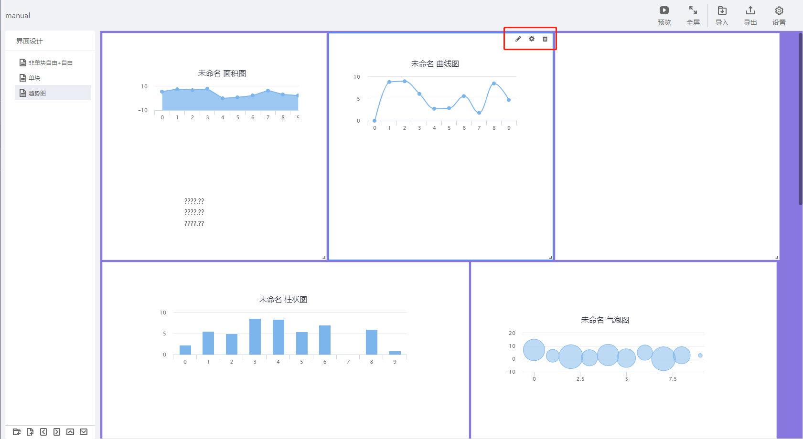
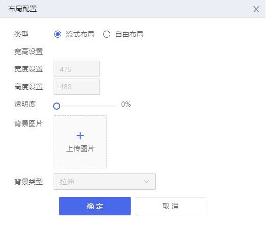
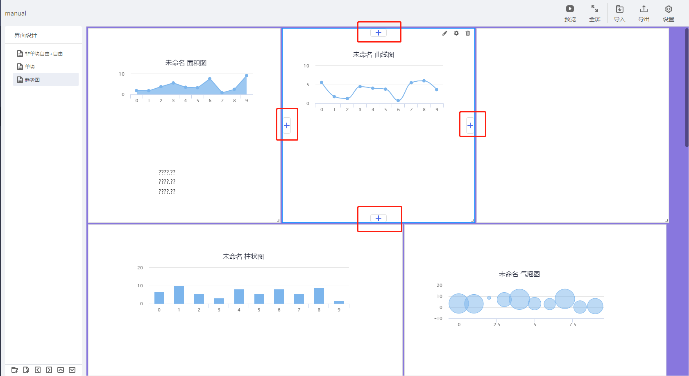
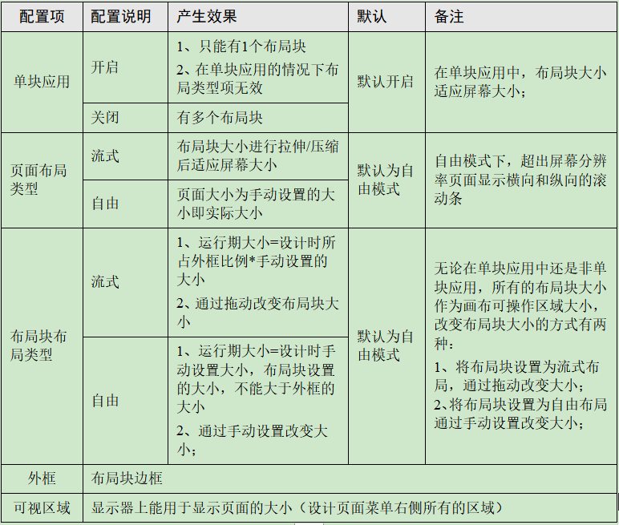

> ## **页面布局**

---

每个页面上放了单个布局块（单块布局）或多个布局块（多块布局），多块布局鼠标放在布局块上，布局块右上角显示操作按钮。

- **编辑**  
  - 进入布局块画布设计界面；
- **设置**  
  - 布局块的布局配置；
- **删除**  
  - 删除布局块，页面上最后一个布局块不能删除；

---

> ### **布局块设置**

---

点击布局块的「**设置**」    图标，弹出「**布局配置**」对话框, 配置相关参数后点击「**确定**」按钮，设置完成。

- **类型**
  - 布局块的布局类型设置，可设置为流式布局或自由布局。
- **宽高设置**
  - 自由布局下设置自由宽度与高度；
- **透明度**
  - 布局块背景的透明度；
- **背景图片**
  - 布局块背景图片设置；
- **背景类型**
  - 背景图片大小与布局块大小的契合度；
    - **横向自适应**
      - 图片横向（宽度）与布局块匹配，纵向填白或裁剪；
    - **纵向自适应**
      - 图片纵向（高度）与布局块匹配，横向填白或裁剪；
    - **拉伸**
      - 将图片拉伸匹配布局块大小；

---

> ### **添加布局块**

---

选中一个布局块，在布局块四面显示    按钮；

在你想要添加布局块的位置点击    按钮，即可增加一个布局块；

---

> ### **布局说明**

---

---

> ### **布局应用**

---

