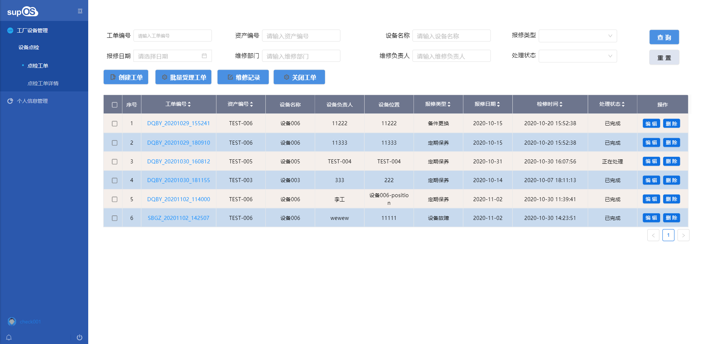
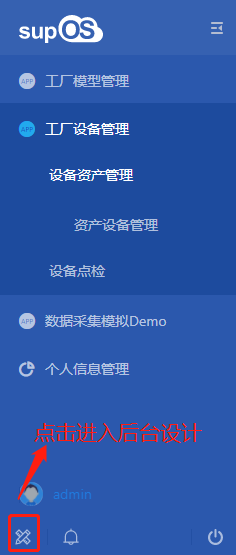
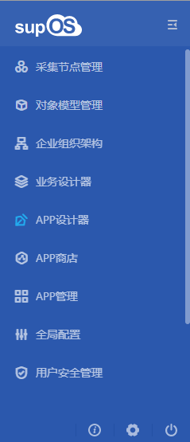
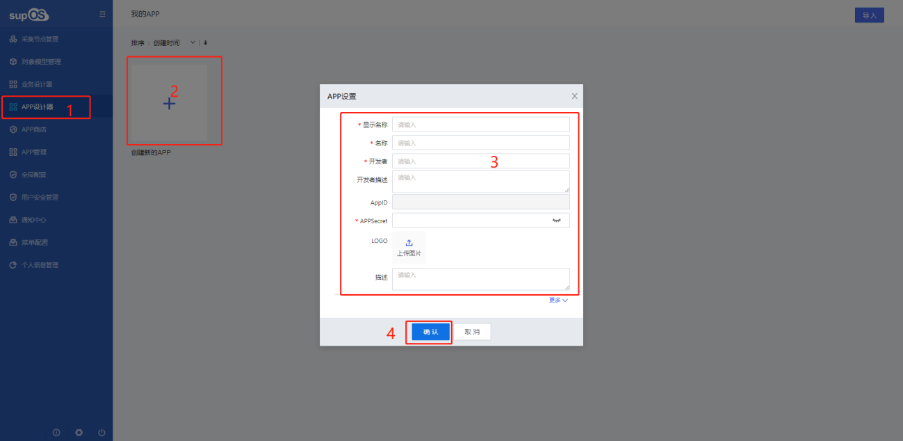
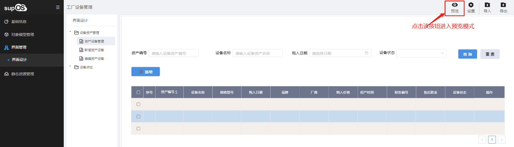
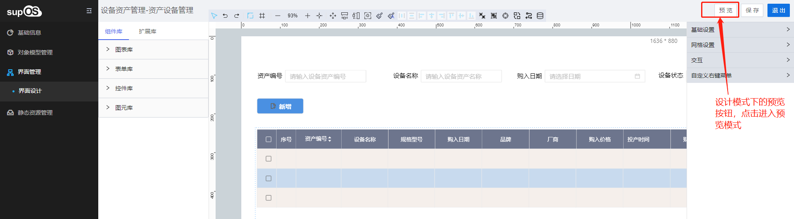

> ## **组态环境**

---

**supOS工业APP组态开发软件提供工业APP软件的组态式开发环境，通过图形化、组件化、模块化的向导式应用构建，利用平台提供的表单设计和工作流设计工具，实现应用场景和业务流程的分析和设计，满足流程监控、在线报表、工业APP业务管理页面、工作流管理、趋势图分析、大屏画面应用等为一体的混合业务编排和场景设计要求。**

---

> ### **名词解析**

---

|序号|名词|名词解释|
|:---:|:---|:---|
|1|工业APP|supOS工业操作系统用于描述一组满足特定场景和业务需求的软件功能定义，是工业技术、工业知识、经验和重要成果的有效载体。|
|2|组态开发|supOS工业操作系统用于描述用户通过配置、设定、拖拽图元等操作，实现业务功能的二次开发与定义过程。|
|3|页面布局|supOS工业操作系统在进行页面设计时提供的整体布局功能，通过布局块的大小拖动和排布，完成整体页面的展示设计。常用的布局方式有自由布局和流式布局。|
|4|画布|supOS工业操作系统提供的页面组态开发环境，用户通过拖、拉、拽的方式完成业务页面的设计和定义。|
|5|布局块|在页面布局时的最小块单元，每个布局块都拥有自己的画布，用户可以自由定义布局块中的内容。|

---

> ### **supOS运行模式**

---

> #### **运行态**

---

「**运行态**」:即最终用户使用时的运行状态。可进行用户端的操作，对于未拥有管理权限的用户，在菜单栏左下角没有「**尺标**」按钮，不能进入supOS后台管理端。

---

> #### **设计模式**

---

拥有管理权限的角色用户，点击菜单栏左下角没有「**尺标**」按钮，进入supOS后台管理端，进行APP设计开发，创建APP，并可以进入该APP进行具体页面设计。

---

> #### **预览模式**

---

在APP设计过程中，可随时点击页面右上方的「**预览**」按钮，实时查看设计情况，是否符合预期。

