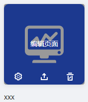

> ## **新建一个APP**

---

> ### **新建APP**

---

在APP设计器界面点击「**创建新的APP**」;

- 在APP设置中输入工业APP显示名称、名称、描述、开发者、开发者描述（名称及开发者仅支持小写英文字母）;
- 上传图片作为该工业APP的封面图标，展开更多选项可设置工业APP基本信息;

输入完成后点击<确认>即可生成工业APP。

---

> ### **导入现有APP**

---

您可以安装已下载到本地的工业APP。

- 在APP设计器界面点击「**导入**」按钮;
- 选择要导入的工业APP压缩文件，点击「**打开**」;
- 工业APP安装完成后会自动更新当前工业APP列表;

工业APP安装支持离线方式，满足实际客户现场的网络环境要求。

---

「注意」 
安装APP无法安装全局或引用的其他APP下的元数据（对象模板、对象实例、功能集合、标签、数据集合）; 
请在安装前将工业APP调用的全局或其他APP下元数据同步到supOS系统。

---

---

> ### **其他操作**

---

> #### **排序**

---

**用户可以根据APP的创建时间或名称对APP进行升序或降序的排列；**

---

> #### **编辑APP**

---

**鼠标在工业APP封面悬停，工业APP显示编辑页面、编辑、导出及删除操作按钮，点击要执行的操作按钮即可。**
- 编辑页面：进入工业APP设计界面；
-  编辑：编辑工业APP基本信息；
- 导出：用户可导出APP列表中的工业APP到本地，完成对工业APP的备份及迁移操作；
- 删除：用户可删除APP列表中的工业APP。删除后不可恢复请谨慎操作。

