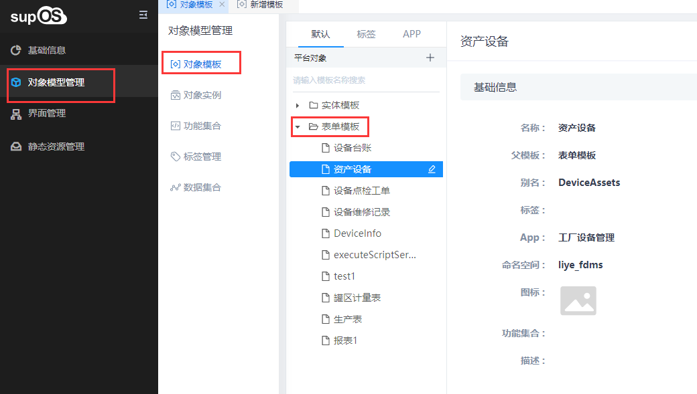

> ## **「设备资产」对象建模**

---

**根据需求分析与表结构分析，需要对等的创建一个表单模板：「设备资产」**

*关于对象模型管理x详细设计请参考[《supOS工厂建模管理软件用户手册V2.4.pdf》](http://oss.supos.com/docs/ProductManual/supOS/V2.8.1/supOS工厂建模管理软件用户手册V2.4.pdf)*

---

* [基本信息](/docs/DeviceInfo/ObjectData/baseInfo)
* [配置属性](/docs/DeviceInfo/ObjectData/attrConfig)