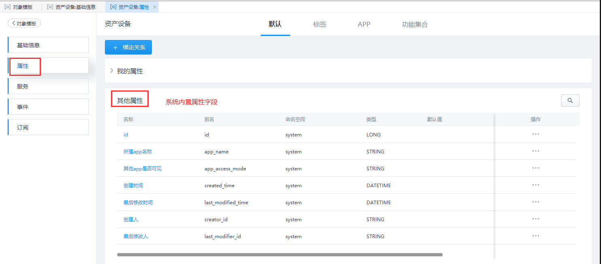
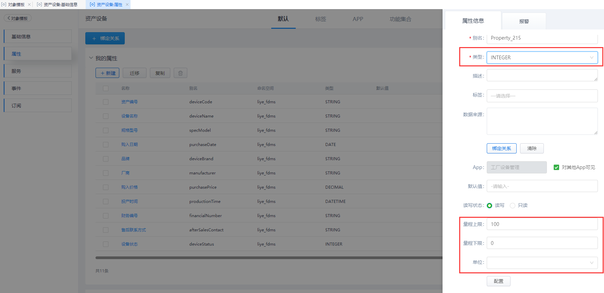
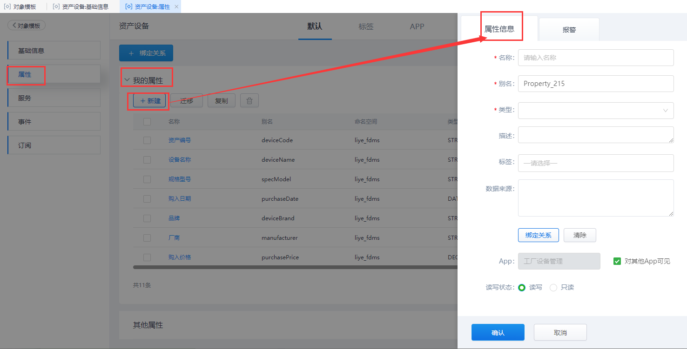
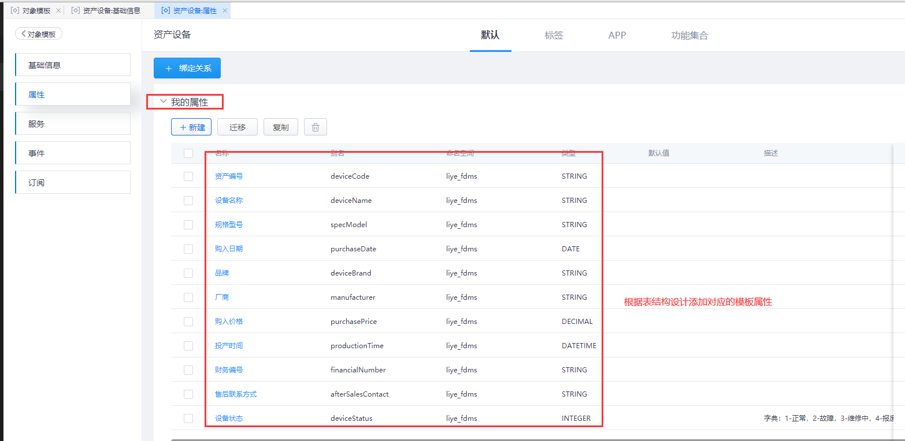

> ## **配置「设备资产」属性**

---

**选中创建成功的「设备资产」表单模板，点击右下角的「详情」按钮进入子页面，选择「属性」标签页，进行字段属性配置；**

**页面将展示：我的属性、其他属性。**

- 「**搜索**」：根据属性名称或别名搜索对象属性；
- 「**我的属性**」：当前对象模板创建的属性，可进行新建、迁移、复制以及删除操作；
- 「**其他属性**」：父模板或功能集合继承的属性，信息不可编辑；
  - 「**提示**」：自动集成父模板属性：id、APP名称、APP是否对外可见、创建人、创建时间、修改人、修改时间。
- 「**绑定关系**」：将属性字段与其他属性字段进行绑定；

---

> ### **配置「我的属性」**

---

通过在之前的需求分析与表结构设计中，其他属性并不能满足当前的设置信息，因此需要在当前模板下，设置对应的字段属性。

- **在「我的属性」下点击「+ 新建」按钮，创建新属性；**
- **配置属性信息；**
  - 「**名称**」：必填，用户可自定义修改。例如：“电压”；
  - 「**别名**」：必填，用于对象模板属性唯一标识，别名自动生成，可根据对象模板属性信息自行修改定义其含义；
  - 「**类型**」：必填，所属数据类型，应与源数据类型一致；
    - 「**数值型**」:Integer、Long、Float、Double等，页面**显示量程属性**；
    - 「**非数值型**」：String、Date、DateTime等，**无**量程属性；
      
  - 「**标签**」：从标签中给对象属性添加多个标签，用于标记属性方便归类查询；
  - 「**数据来源**」：将模板属性字段与其他属性字段进行关系绑定；
  - 「**默认值**」：设置对象属性默认值；
  - 「**读写状态**」：选择「只读」，则属性值是静态的，无法写入值。若需要对值进行修改，唯一方式就是更改默认值；选择「读写」，该属性值可在脚本逻辑中被重写；
  - 「**持久化**」：如果勾选该选项，则当这个属性值发生变化后会将最新值保存到supOS系统中。
  - 「**描述**」：对象模板属性的详情描述；
  - 「**量程上限**」：输入量程上限，即数据限制最大值；
  - 「**量程下限**」：输入量程上限，即数据限制最小值；
  - 「**单位**」：属性数据对应单位，点击<配置>可以自定义单位；
  - 「**小数**」：小数位数定义，对Double和Float类型设置小数点位数；
- **点击「确认」按钮，即添加我的属性完成；**

**以此类推，根据「设备资产」表结构设计，创建所有的自定义属性信息**

---

> ### **「资产设备」对象实例**

---

对象模板创建成功后，将自动生成与之对应的对象实例记录，相当于一张实例表。之后CURD的相关数据变化均在此可以体现出来。

**至此，一张简单的设备资产信息表，创建成功，对象建模创建成功。下面即可进入「界面管理」进行页面组态设计。**
