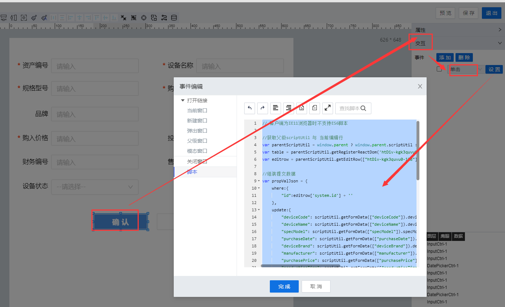

> ## **「编辑数据提交」**

---



---

```JS
// 客户端为IE11浏览器时不支持ES6脚本

//获取父级scriptUtil 与 当前编辑行
var parentScriptUtil = window.parent ? window.parent.scriptUtil : scriptUtil;
var table = parentScriptUtil.getRegisterReactDom('htDiv-kgk3quvu0-128');//获取dataTable控件
var editrow = parentScriptUtil.getEditRow(["htDiv-kgk3quvu0-128"]);//获取当前编辑行数据

//组装提交数据
var propValJson = {
    where:{
        "id":editrow['system.id'] + ''
    },
    update:{
        "deviceCode": scriptUtil.getFormData(["deviceCode"]).deviceCode,
        "deviceName": scriptUtil.getFormData(["deviceName"]).deviceName,
        "specModel": scriptUtil.getFormData(["specModel"]).specModel,
        "purchaseDate": scriptUtil.getFormData(["purchaseDate"]).purchaseDate,
        "deviceBrand": scriptUtil.getFormData(["deviceBrand"]).deviceBrand,
        "manufacturer": scriptUtil.getFormData(["manufacturer"]).manufacturer,
        "purchasePrice": scriptUtil.getFormData(["purchasePrice"]).purchasePrice,
        "productionTime": scriptUtil.getFormData(["productionTime"]).productionTime,
        "financialNumber": scriptUtil.getFormData(["financialNumber"]).financialNumber,
        "afterSalesContact": scriptUtil.getFormData(["afterSalesContact"]).afterSalesContact,
        "deviceStatus": scriptUtil.getFormData(["deviceStatus"]).deviceStatus
    }
};

scriptUtil.request("/project/dam/supngin/api/dam/runtime/liye_fdms/template/DeviceAssets/service/system/UpdateDataTableEntry",{
    method:"POST",
    headers:{
        'X-Namespace': 'liye_fdms'
    },
    body:{
        updateData:JSON.stringify(propValJson)
    }
}).then(function(res){
    if(res.code != "200" && res.code != "201"){
        scriptUtil.showMessage(res.getMessage(),'error');
    }else{
        scriptUtil.showMessage('编辑成功','success');
        //重新加载列表数据
        table.reloadTableData();
        //关闭当前弹出窗
        parentScriptUtil.showModal({ modalVisible: false });
        parentScriptUtil.showMessage("编辑成功", "success");
    }
});

```