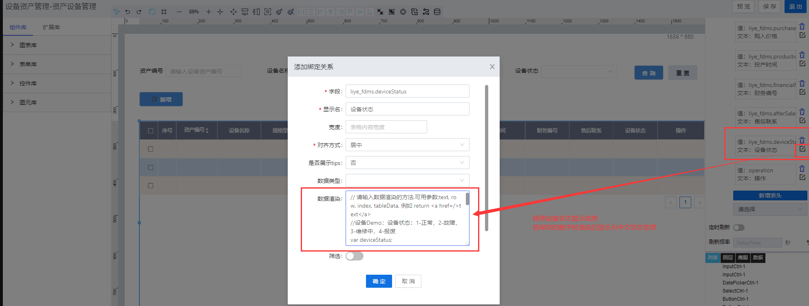

> ## **「设备状态列」渲染**

---



---

```JS
// 请输入数据渲染的方法,可用参数:text, row, index, tableData, 例如 return <a href=/>text</a>
//设备Demo：设备状态：1-正常，2-故障，3-维修中，4-报废
var deviceStatus;
switch(text) {
    case 1:
        deviceStatus = "正常";
        break;
    case 2:
        deviceStatus = "故障";
        break;
    case 3:
        deviceStatus = "维修中";
        break;
    case 4:
        deviceStatus = "报废";
        break;
    default:
        deviceStatus = "";
} 
return deviceStatus;
```