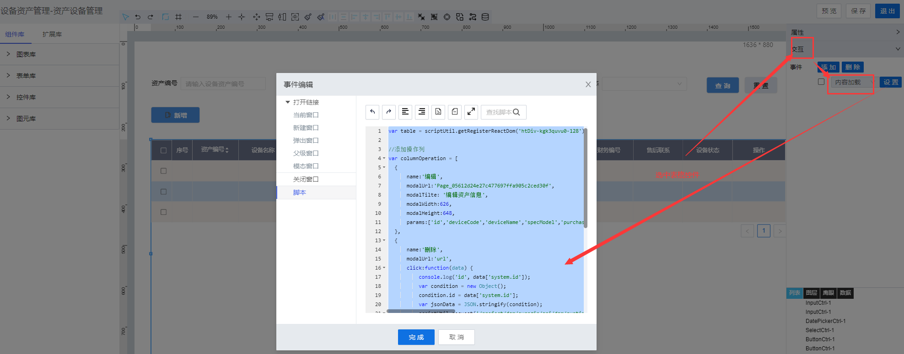

> ## **「table数据加载/操作列」渲染**

---



---

```JS
var table = scriptUtil.getRegisterReactDom('htDiv-kgk3quvu0-128');//table控件id

//添加操作列
var columnOperation = [
  {
      name:'编辑',
      modalUrl:'Page_05612d24e27c477697ffa905c2ced30f',
      modalTilte: '编辑资产信息',
      modalWidth:626, 
      modalHeight:648,
      params:['id','deviceCode','deviceName','specModel','purchaseDate','deviceBrand','manufacturer','purchasePrice','productionTime','financialNumber','afterSalesContact','deviceStatus']
  },
  {
      name:'删除',
      modalUrl:'url',
      click:function(data) {
          var condition = new Object();
          condition.id = data['system.id'];
          var jsonData = JSON.stringify(condition);   
          scriptUtil.request('/project/dam/supngin/api/dam/runtime/liye_fdms/template/DeviceAssets/service/system/DeleteDataTableEntries',{
            method: 'POST',
            headers: {
                'X-Namespace': 'liye_fdms'
            },
            body: {
                "condition":jsonData
            }
        }).then(function(res){
          table.reloadTableData();
        });
      }
  }
];
table.setColumnOperation(columnOperation);

```