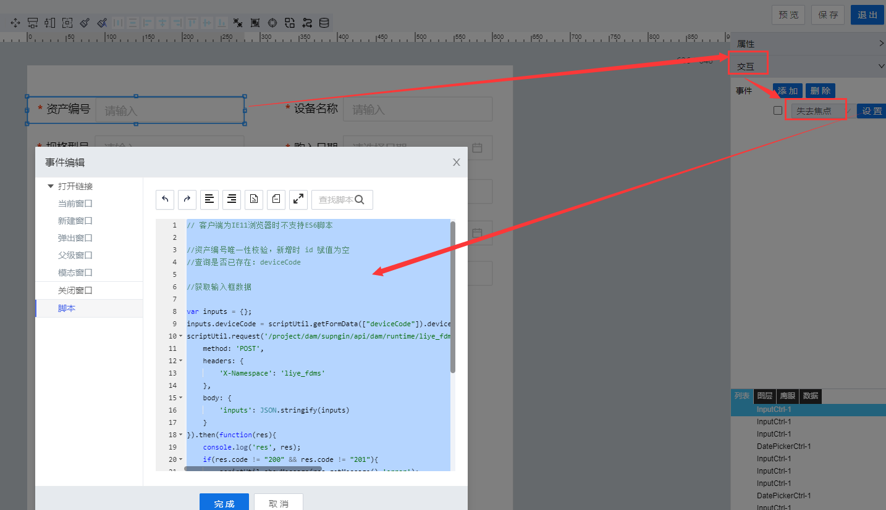

> ## **「deviceCode唯一性校验」**

---



---

```JS
// 客户端为IE11浏览器时不支持ES6脚本

//资产编号唯一性校验，新增时 id 赋值为空
//查询是否已存在：deviceCode

//获取输入框数据
var inputs = {};
inputs.deviceCode = scriptUtil.getFormData(["deviceCode"]).deviceCode;
scriptUtil.request('/project/dam/supngin/api/dam/runtime/liye_fdms/template/DeviceAssets/service/system/getDataTableScript',{
    method: 'POST',
    headers: {
        'X-Namespace': 'liye_fdms'
    },
    body: {
        'inputs': JSON.stringify(inputs)
    }
}).then(function(res){
    if(res.code != "200" && res.code != "201"){
        scriptUtil.showMessage(res.getMessage(),'error');
    }else{
        var dataCount = res.data.result.pagination.total;
        if(dataCount > 0){
            scriptUtil.showMessage("已存在当前设备资产编号数据，请重新输入资产编号的值",'error');
            //输入框置空
            scriptUtil.setFormData({
                "deviceCode":""
            });
        }
    }
});
```