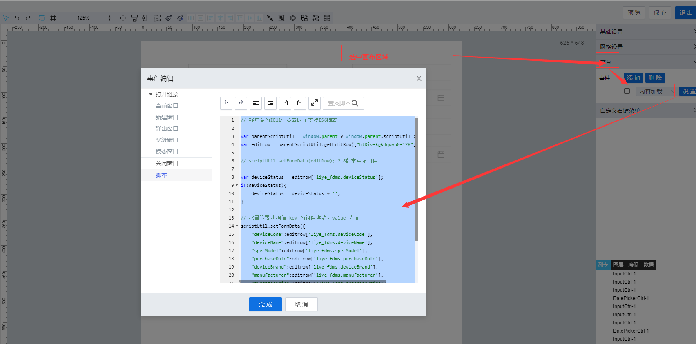

> ## **「编辑数据初始化」**

---



---

```JS
// 客户端为IE11浏览器时不支持ES6脚本

var parentScriptUtil = window.parent ? window.parent.scriptUtil : scriptUtil;
var editrow = parentScriptUtil.getEditRow(["htDiv-kgk3quvu0-128"]);//获取编辑行记录数据Object

//如果要转换字符串
var deviceStatus = editrow['liye_fdms.deviceStatus'];
if(deviceStatus){
    deviceStatus = deviceStatus + '';
}

// 批量设置数据值 key 为组件名称，value 为值
scriptUtil.setFormData({
    "deviceCode":editrow['liye_fdms.deviceCode'],
    "deviceName":editrow['liye_fdms.deviceName'],
    "specModel":editrow['liye_fdms.specModel'],
    "purchaseDate":editrow['liye_fdms.purchaseDate'],
    "deviceBrand":editrow['liye_fdms.deviceBrand'],
    "manufacturer":editrow['liye_fdms.manufacturer'],
    "purchasePrice":editrow['liye_fdms.purchasePrice'],
    "productionTime":editrow['liye_fdms.productionTime'],
    "financialNumber":editrow['liye_fdms.financialNumber'],
    "afterSalesContact":editrow['liye_fdms.afterSalesContact'],
    'deviceStatus':deviceStatus
});
```