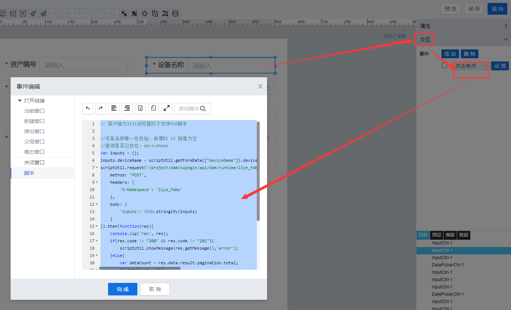

> ## **「编辑_deviceName唯一性校验」**

---



---

```JS
// 客户端为IE11浏览器时不支持ES6脚本

//资产编号唯一性校验，编辑时获取 行id
//查询是否已存在：devicename
var parentScriptUtil = window.parent ? window.parent.scriptUtil : scriptUtil;
var editrow = parentScriptUtil.getEditRow(["htDiv-kgk3quvu0-128"]);//获取当期编辑行数据
var rowId = editrow['system.id'];//获取行记录id
var _deviceName = editrow['liye_fdms.deviceName'];//获取编辑前deviceName

//获取输入框数据
var inputs = {};
inputs.deviceName = scriptUtil.getFormData(["deviceName"]).deviceName;//获取当前输入框内deviceName的值

scriptUtil.request('/project/dam/supngin/api/dam/runtime/liye_fdms/template/DeviceAssets/service/system/getDataTableScript',{
    method: 'POST',
    headers: {
        'X-Namespace': 'liye_fdms'
    },
    body: {
        'inputs': JSON.stringify(inputs)
    }
}).then(function(res){
    if(res.code != "200" && res.code != "201"){
        scriptUtil.showMessage(res.getMessage(),'error');
    }else{
        var dataList = res.data.result.list;
        if(dataList != null && dataList.length > 0){
            var itemCount = 0;
            dataList.forEach(function(item){
                var _id = item['system.id'];
                if(_id != rowId){
                    itemCount++;
                }
            });
            if(itemCount > 0){
                scriptUtil.showMessage("已存在当前设备名称数据，请重新输入设备名称的值",'error');
                //重置为初始化数据
                scriptUtil.setFormData({
                    "deviceName":_deviceName
                });
            }
        }
    }
});

```