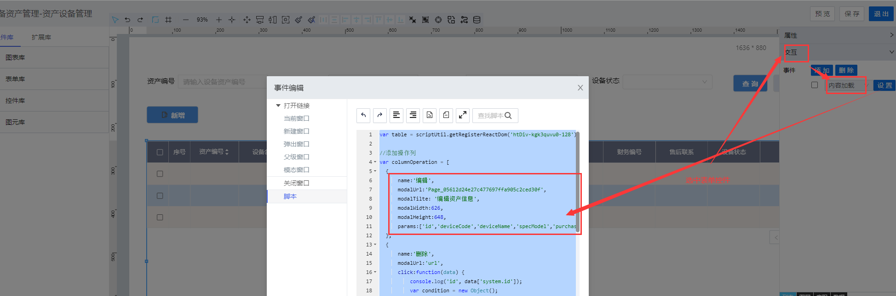
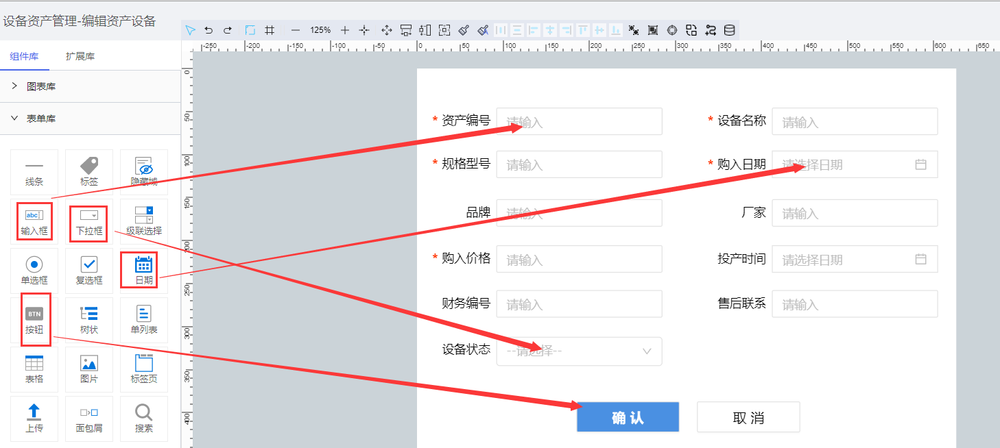

> ## **编辑「资产设备管理」**

---

- **创建「编辑资产设备」新页面；**
- **在列表页面设置「编辑」按钮「单击」事件；**
- **设置其打开「模态窗口」，链接指向新创建的编辑页面；**

---

> ### **页面功能分析**

---

- 信息编辑「**确认提交**」；
  - 修改设备资产信息后，提交信息创建；
- 「**内容校验**」：必填性校验与数据格式校验；
  - 提交数据时，对必填性字段及对应格式的数据进行格式校验；
- 「**唯一性校验**」；
  - 提交数据时，调用接口，校验资产编号与设备名称在记录里是唯一的；
- 取消编辑「**取消**」；
  - 点击取消按钮，不提交当前修改信息，且关闭当前模态窗口；

---

> ### **所需控件及关键操作说明**

---

- **主要用到表单库中的：输入框、按钮、下拉框、日期控件；**
- **根据UI设计，将对应的控件拖拽到画布上，可打开网格视角调整对齐格式等样式；**

---

以下设置过程，大致流程参见：[新增设备中的相关操作](/docs/DeviceInfo/PageDesign/addDevice)
- **设置控件名称**
- **「下拉框」绑定数据源**
- **「日期控件」显示指定格式数据**
- **「内容校验」必填校验与格式校验**
- **「数据唯一性校验」**

---

> ### 脚本服务示例

---

**选中相应的控件，点击右侧的「交互」属性，为相应的控件绑定「单击」「数据加载」等事件，将对应的脚本服务代码写入，执行服务。**

- **常用服务参考**
  - [常用脚本服务](/docs/DeviceInfo/ObjectService/commonJS)
  - [内置对象服务](https://supos-project.github.io/supOS-Object-Documents/#/docs/ObjectService/Service/)
- **当前页面使用脚本**
  - [编辑数据初始化](/docs/DeviceInfo/ObjectService/editDataResource)
  - [编辑数据提交](/docs/DeviceInfo/ObjectService/buttonEdit)
  - [取消编辑数据](/docs/DeviceInfo/ObjectService/buttonCancelEdit)
  - [编辑_deviceCode唯一性校验](/docs/DeviceInfo/ObjectService/editDeviceCodeUniq)
  - [编辑_deviceName唯一性校验](/docs/DeviceInfo/ObjectService/editDeviceNameUniq)