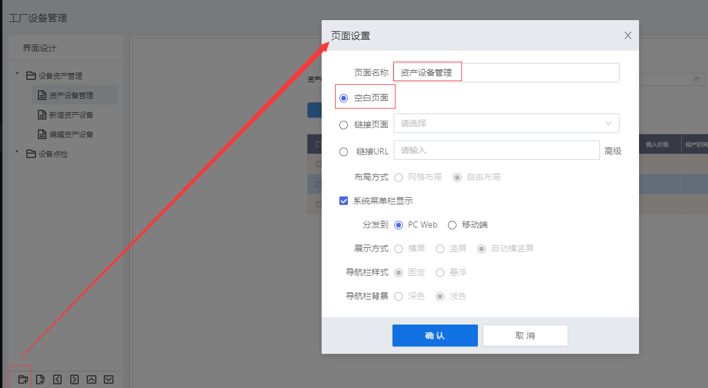
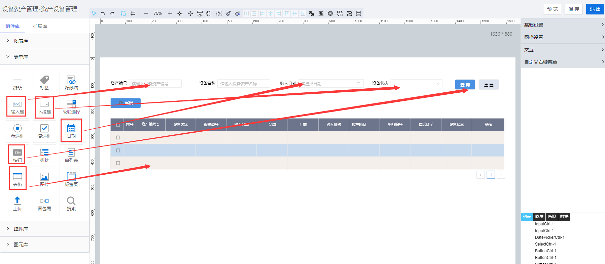
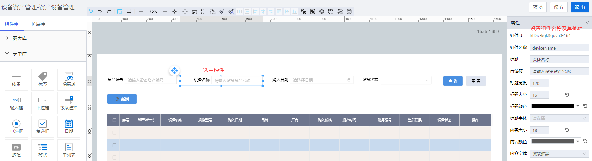
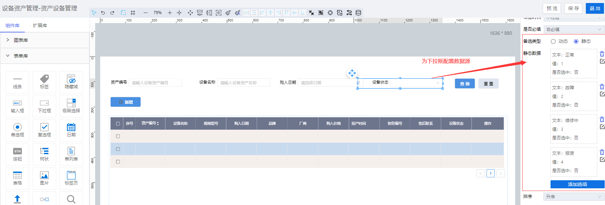
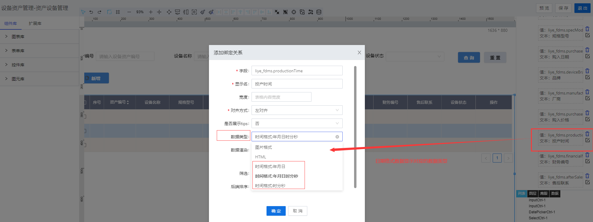
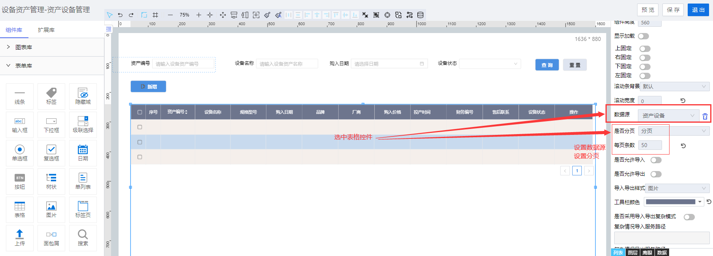
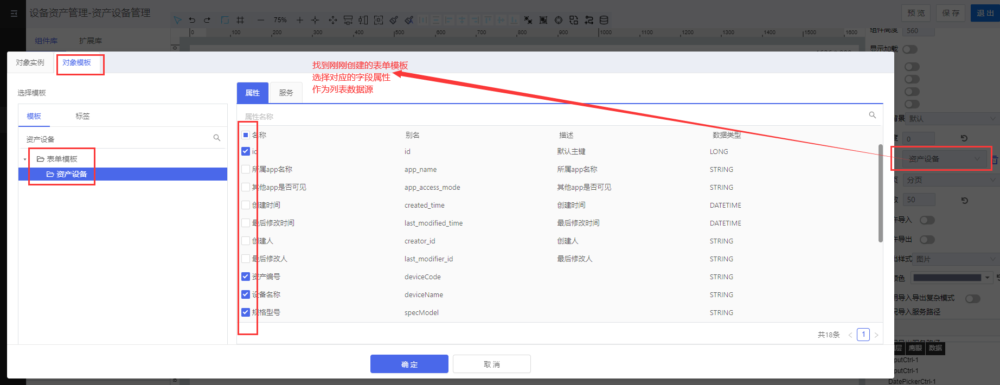
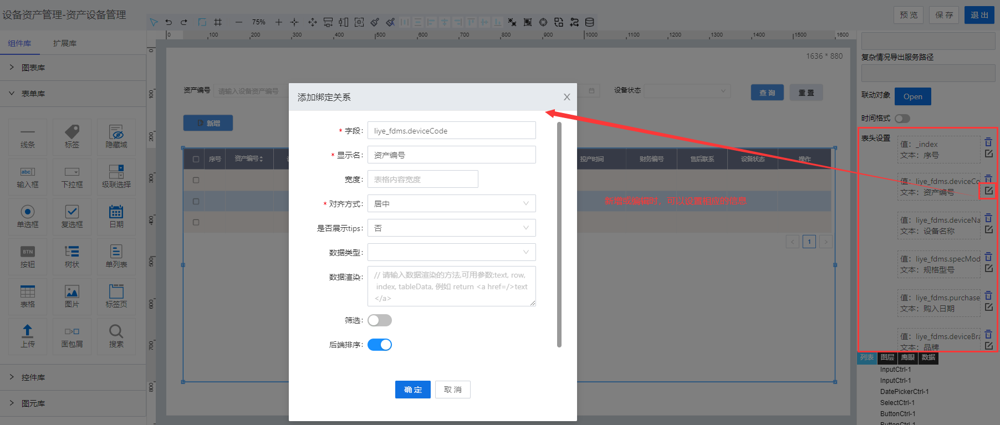

> ## **列表页面**

---

> ### **新增「**资产设备管理**」页面** 

---

- **根据基础操作介绍，新增「**资产设备管理**」页面；**
- **双击页面空白处，或者点击页面右上角的编辑按钮，进入画布设计器；**

---

> ### **页面功能分析** 

---

- 搜索「**条件查询**」；
  - 根据资产编号、设备名称、购入日期、设备状态查询设备列表信息；
- 搜索「**条件重置**」；
  - 重置查询条件；
- 列表「**数据初始化**」：分页展示；
  - 页面刚进来时需要加载已有的数据；
  - 分页进行展示；
- 操作列渲染：「**编辑**」和「**删除**」；
  - 行记录右侧增加操作属性，可根据id编辑与删除相应的记录信息；
- 「**新增**」；
  - 点击该按钮，触发新增资产设备信息事件；

---

> ### **所需控件及关键操作说明** 

---

- **主要用到表单库中的：输入框、按钮、下拉框、日期控件、表格；**
- **根据UI设计，将对应的控件拖拽到画布上，可打开网格视角调整对齐格式等样式；**

---

> #### **设置控件名称** 

---

- **为每一个控件设置控件别名，方便通过别名获取其属性值；**
  - 「**提示**」：这里控件名称最好与对象模板中的属性字段别名保持一致，不至于在众多控件中找不到对应的属性，也方便后面取值或者设置属性值！

---

> #### **「下拉框」绑定数据源**

---

- **为「状态」下拉框，配置静态数据源**

---

> #### **「日期列」显示指定格式数据**

---

- **选中对应的操作列，点击编辑，选择对应的日期格式数据类型**

---

> #### **「表格控件」绑定数据源与设置分页**

---

---

> #### **「表格控件」设置表头**

---

| 名称         | Key          | 描述                                                                                                                       | 类型                                                            | 默认值 |
| ------------ | ------------ | ---------------------------------- | --------------------------------------------------------------- | ------ |
| 字段         | originalName | 数据返回的字段key值                                                                                                        | string                                                          |        |
| 显示名       | customName   | 数据key对应的显示名称                                                                                                      | string                                                          |        |
| 宽度         | width        | 列宽度设置                                                                                                                 | number                                                          |        |
| 对齐方式     | align        | 表头和表格数据对齐方式：左对齐，居中对齐，右对齐                                                                           | string                                                          | 左对齐 |
| 是否展示tips | hasTips      | 当行展示显示，用省略号来标识,  true 'true' 或者 ‘是’ 都代表显示tips                                                        | string                                                          | 否     |
| 数据类型     | type         | 数据的显示类型，图片格式（image）； 时间格式：年月日（date）、年月日时分秒（dateTime）、时分秒（time） ；                     | string                                                          | \-     |
| 数据渲染     | render       | 原始数据经过二次渲染的数据; 入参有 text（当前数据）0,row（当前行数据）,index（当前行数据下标）,table（当前table所有的数据） | function\(text,row,index,table\)\{    return text; // 填写部分 \} | \-     |
| 筛选         | isFilter     | 是否支持后端筛选                                                                                                           |                                                                 |        |
| 后端排序     | sorterB      | 是否支持后端排序                                                                                                           |                                                                 |        |

---

「注意」配置参数 
「序号」的字段默认为 _index； 
「操作」的字段默认为 'operation'； 

---

---

> ### 脚本服务示例

---

**选中相应的控件，点击右侧的「交互」属性，为相应的控件绑定「单击」「数据加载」等事件，将对应的脚本服务代码写入，执行服务。**

- **常用服务参考**
  - [常用脚本服务](/docs/DeviceInfo/ObjectService/commonJS)
  - [内置对象服务](https://supos-project.github.io/supOS-Object-Documents/#/docs/ObjectService/Service/)
- **当前页面使用脚本**
  - [条件查询](/docs/DeviceInfo/ObjectService/buttonSearch)
  - [查询重置](/docs/DeviceInfo/ObjectService/buttonReset)
  - [DataTable操作列渲染](/docs/DeviceInfo/ObjectService/dataTableOperation)
  - [DataTable状态列渲染](/docs/DeviceInfo/ObjectService/dataTableDropdown)