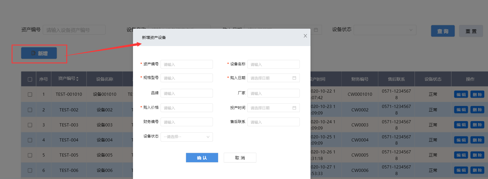
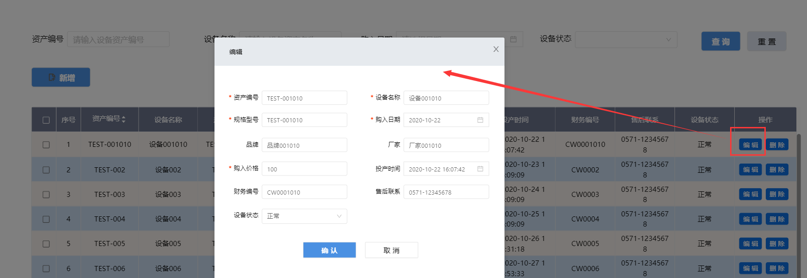

> ## **设备台账 Demo APP 展示**

---

> ### **设备资产列表**

---

**当前页面展示设备资产信息的列表记录。**

---

> ## **新增设备信息**

---

**点击页面上方的「+ 新增」按钮，弹出添加设备资产信息页面，填写相应信息，点击「确认」按钮，完成新增。**

---

> ## **编辑设备信息**

---

**点击行记录右侧的「编辑」按钮，弹出编辑当前行记录设备资产信息页面，修改相应信息，点击「确认」按钮，完成编辑操作。**

