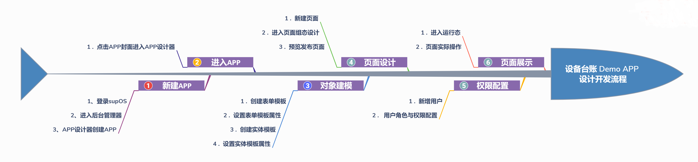

> ## **APP设计思路**

---

> ### **设计流程**

---

---

> ### **需求分析**

---

- **列表页面**需要如下主要功能：
  - 搜索「**条件查询**」；
  - 搜索「**条件重置**」；
  - 列表「**数据初始化**」：分页展示；
  - 操作列渲染：「**编辑**」和「**删除**」；
  - 「**新增**」；

---

- **新增页面**需要如下主要功能：
  - 「**确认**」按钮事件；
  - 「**唯一性**」校验事件；

---

- **编辑页面**需要如下主要功能：
  - 编辑行记录「**数据初始化**」；
  - 「**确认**」按钮事件；
  - 「**唯一性**」校验事件；

---

> ### **表设计**

---

当前案例中，设备资产信息设定主要包含以下属性字段

|名称|字段名|字段类型|
|:---|:---|:---|
|资产编号|deviceCode|STRING|
|设备名称|deviceName|STRING|
|规格型号|specModel|STRING|
|购入日期|purchaseDate|DATE|
|品牌|deviceBrand|STRING|
|厂商|manufacturer|STRING|
|购入价格|purchasePrice|DECIMAL|
|投产时间|productionTime|DATETIME|
|财务编号|financialNumber|STRING|
|售后联系方式|afterSalesContact|STRING|
|设备状态|deviceStatus|INTEGER|

---

> ### **基础操作参考**

---

- 参考：[**新建APP**](/docs/BasicOperation/createNewApp)
- 参考：[**APP设计器**](/docs/BasicOperation/DesignerMenu/)
- 参考：[**对象建模**](/docs/Summary/conceptIntro)
- 参考：[**界面设计**](/docs/BasicOperation/PageDesign/)