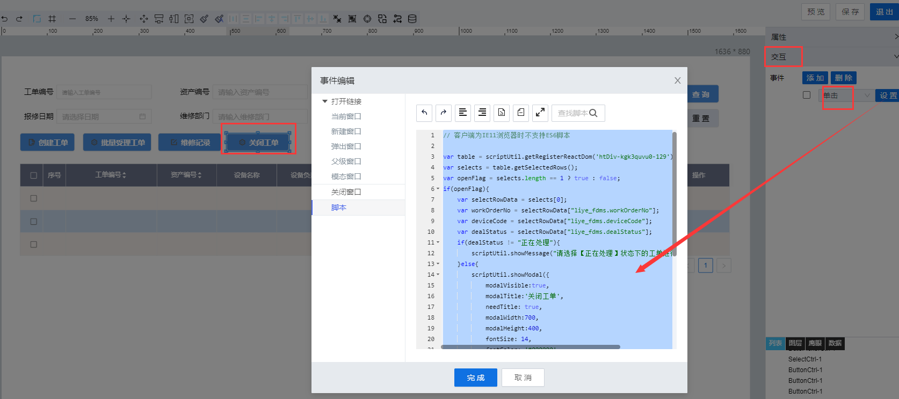

> ## **「点检工单--关闭工单」按钮**

---



---

```JS
// 客户端为IE11浏览器时不支持ES6脚本
var table = scriptUtil.getRegisterReactDom('htDiv-kgk3quvu0-129');//根据组件id获取dataTable对象
var selects = table.getSelectedRows();//获取选中行记录数据
var openFlag = selects.length == 1 ? true : false;
if(openFlag){
    var selectRowData = selects[0];
    var workOrderNo = selectRowData["liye_fdms.workOrderNo"];
    var deviceCode = selectRowData["liye_fdms.deviceCode"];
    var dealStatus = selectRowData["liye_fdms.dealStatus"];
    if(dealStatus != "正在处理"){
        scriptUtil.showMessage("请选择【正在处理】状态下的工单进行操作！",'error');
    }else{
        //如果满足条件，点击按钮后，弹出模态窗口
        scriptUtil.showModal({
            modalVisible:true, 
            modalTitle:'关闭工单', 
            needTitle: true,
            modalWidth:700, 
            modalHeight:300,
            fontSize: 14,
            fontColor: '#000000',
            titleBgColor: 'rgba(230,234,238,1)',
            contentBgColor: '#ffffff',
            isIframe: true,
            isCenter: true,
            modalIsCenter: true,
            isSandbox: true,
            pageId: 'Page_142cf5fcb15347fb9400ef93f2872bbc',
            modalContent: 'Page_142cf5fcb15347fb9400ef93f2872bbc'
        });
    }
}else{
    scriptUtil.showMessage("请选择一行且只选择一条工单记录进行处理！",'error');
}
```