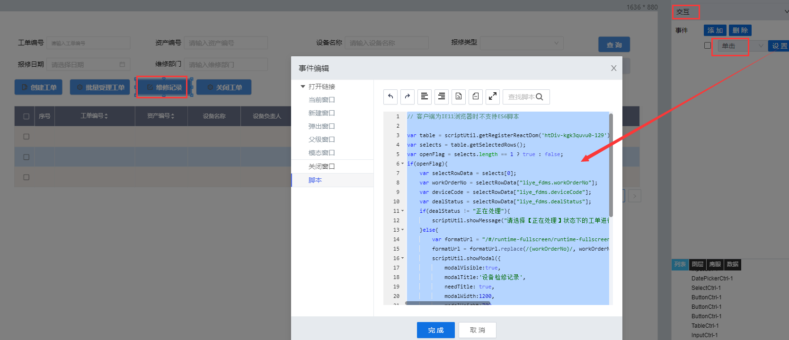

> ## **「点检工单--维修记录」按钮**

---



---

```JS
// 客户端为IE11浏览器时不支持ES6脚本
var table = scriptUtil.getRegisterReactDom('htDiv-kgk3quvu0-129');//根据组件id获取当前DataTable对象
var selects = table.getSelectedRows();//获取选中的行记录数据
var openFlag = selects.length == 1 ? true : false;
if(openFlag){
    var selectRowData = selects[0];
    var workOrderNo = selectRowData["liye_fdms.workOrderNo"];
    var deviceCode = selectRowData["liye_fdms.deviceCode"];
    var dealStatus = selectRowData["liye_fdms.dealStatus"];
    if(dealStatus != "正在处理"){
        scriptUtil.showMessage("请选择【正在处理】状态下的工单进行操作！",'error');
    }else{
        var formatUrl = "/#/runtime-fullscreen/runtime-fullscreen/Page_fb54d79e554a4d4babd8e3d6fbf20719?workOrderNo={workOrderNo}&deviceCode={deviceCode}";
        formatUrl = formatUrl.replace(/{workOrderNo}/, workOrderNo).replace(/{deviceCode}/, deviceCode);
        scriptUtil.showModal({
            modalVisible:true, 
            modalTitle:'设备检修记录', 
            needTitle: true,
            modalWidth:1200, 
            modalHeight:700,
            fontSize: 14,
            fontColor: '#000000',
            titleBgColor: 'rgba(230,234,238,1)',
            contentBgColor: '#ffffff',
            isIframe: true,
            isCenter: true,
            modalIsCenter: true,
            isSandbox: true,
            pageId: 'Page_45301633d2cc47bc88e7fcfd6915d636',
            modalContent: 'Page_45301633d2cc47bc88e7fcfd6915d636'
        });
    }
}else{
    scriptUtil.showMessage("请选择一行且只选择一条工单记录进行处理！",'error');
}
```