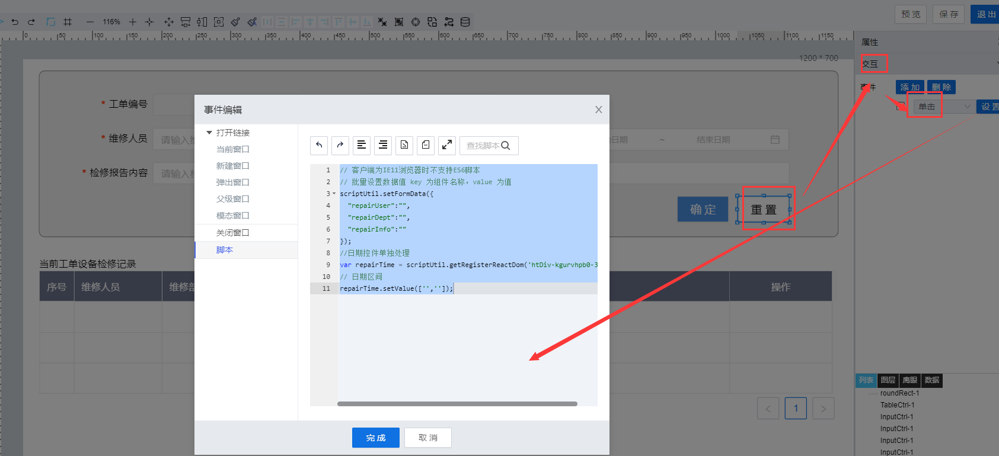

> ## **「工单维修记录--重置数据」**

---



---

```JS
// 客户端为IE11浏览器时不支持ES6脚本
// 批量设置数据值 key 为组件名称，value 为值
scriptUtil.setFormData({
    "repairUser":"",
    "repairDept":"",
    "repairInfo":""
  });
  //日期控件单独处理
  var repairTime = scriptUtil.getRegisterReactDom('htDiv-kgurvhpb0-312');
  // 日期区间
  repairTime.setValue(['','']);
```