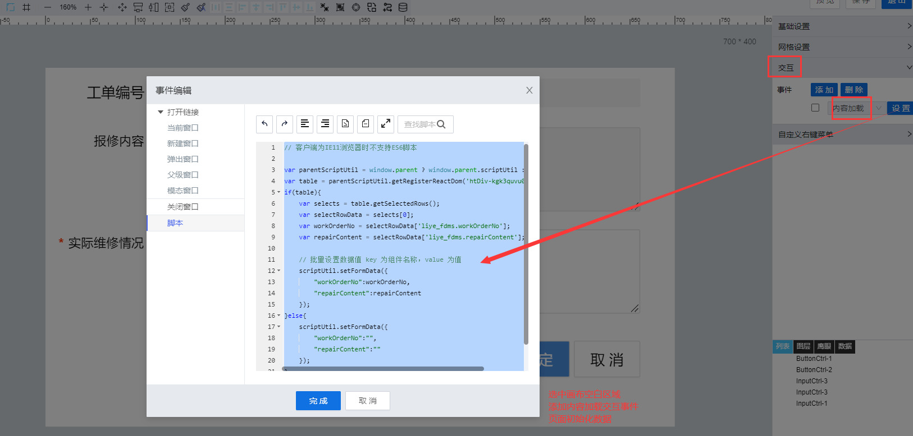

> ## **「关闭点检工单--内容加载」**

---



---

```JS
// 客户端为IE11浏览器时不支持ES6脚本
var parentScriptUtil = window.parent ? window.parent.scriptUtil : scriptUtil;
var table = parentScriptUtil.getRegisterReactDom('htDiv-kgk3quvu0-129');
if(table){
    var selects = table.getSelectedRows();
    var selectRowData = selects[0];
    var workOrderNo = selectRowData['liye_fdms.workOrderNo'];
    var repairContent = selectRowData['liye_fdms.repairContent'];

    // 批量设置数据值 key 为组件名称，value 为值
    scriptUtil.setFormData({
        "workOrderNo":workOrderNo,
        "repairContent":repairContent
    });
}else{
    scriptUtil.setFormData({
        "workOrderNo":"",
        "repairContent":""
    });
}
```