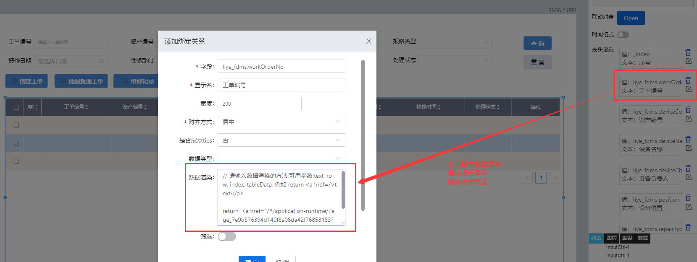

> ## **「点检工单--工单编号列」渲染**

---



---

```JS
// 请输入数据渲染的方法,可用参数:text, row, index, tableData, 例如 return <a href=/>text</a>
return '<a href="/#/application-runtime/Page_7e9d376394d140f8a08da42f76858183?workOrderNo=' + text + '">' + text + "</a>";
```