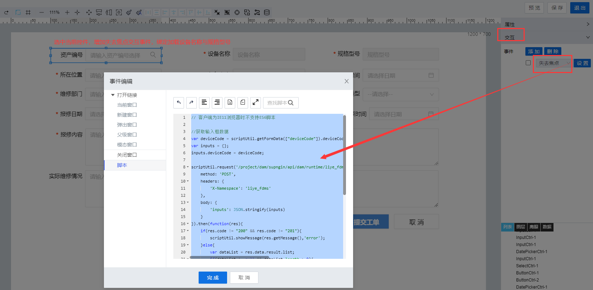

> ## **「创建点检工单--设备检索绑定」**

---



---

```JS
// 客户端为IE11浏览器时不支持ES6脚本

//获取输入框数据
var deviceCode = scriptUtil.getFormData(["deviceCode"]).deviceCode;//获取搜索框选定数据
var inputs = {};
inputs.deviceCode = deviceCode;

scriptUtil.request('/project/dam/supngin/api/dam/runtime/liye_fdms/template/DeviceAssets/service/system/getDataTableScript',{
    method: 'POST',
    headers: {
        'X-Namespace': 'liye_fdms'
    },
    body: {
        'inputs': JSON.stringify(inputs)
    }
}).then(function(res){
    if(res.code != "200" && res.code != "201"){
        scriptUtil.showMessage(res.getMessage(),'error');
    }else{
        var dataList = res.data.result.list;
        if(dataList != null && dataList.length > 0){
            dataList.forEach(function(item){
                var _deviceCode = item.liye_fdms_devicecode;
                if(_deviceCode == deviceCode){
                    scriptUtil.setFormData({
                        "deviceName":item.liye_fdms_devicename,
                        "specModel":item.liye_fdms_specmodel,
                    });
                }
            });
        }
    }
});

```