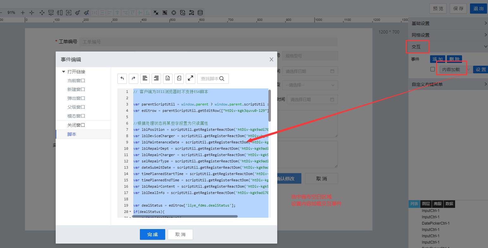

> ## **「编辑点检工单--数据初始化」**

---



---

```JS
// 客户端为IE11浏览器时不支持ES6脚本
var parentScriptUtil = window.parent ? window.parent.scriptUtil : scriptUtil;
var editrow = parentScriptUtil.getEditRow(["htDiv-kgk3quvu0-129"]);

//根据组件id获取控件对象
var lblPosition = scriptUtil.getRegisterReactDom('htDiv-kgk9adi70-738');
var lblDeviceCharger = scriptUtil.getRegisterReactDom('htDiv-kgk9adi70-757');
var lblMaintenanceDate = scriptUtil.getRegisterReactDom('htDiv-kgk9adi70-737');
var lblRepairDept = scriptUtil.getRegisterReactDom('htDiv-kgk9adi70-758');
var lblRepairCharger = scriptUtil.getRegisterReactDom('htDiv-kgk9adi70-760');
var selRepairType = scriptUtil.getRegisterReactDom('htDiv-kgk9adi70-1453');
var dateSubmitDate = scriptUtil.getRegisterReactDom('htDiv-kgk9adi70-759');
var timePlannedStartTime = scriptUtil.getRegisterReactDom('htDiv-kgk9adi70-19279');
var timePlannedEndTime = scriptUtil.getRegisterReactDom('htDiv-kgk9adi70-19763');
var lblRepairContent = scriptUtil.getRegisterReactDom('htDiv-kgk9adi70-20535');
var lblDealInfo = scriptUtil.getRegisterReactDom('htDiv-kgk9adi70-22767');

//根据不同的状态，设置控件是否只读
var dealStatus = editrow['liye_fdms.dealStatus'];
if(dealStatus){
    switch(dealStatus){
        case '正在处理':
            lblPosition.setReadOnly(true);
            lblDeviceCharger.setReadOnly(true);
            lblMaintenanceDate.setReadOnly(true);
            lblRepairDept.setReadOnly(true);
            lblRepairCharger.setReadOnly(true);
            selRepairType.setReadOnly(true);
            dateSubmitDate.setReadOnly(true);
            timePlannedStartTime.setReadOnly(true);
            timePlannedEndTime.setReadOnly(true);
            lblRepairContent.setReadOnly(true);
            break;
        case '已完成':
            lblPosition.setReadOnly(true);
            lblDeviceCharger.setReadOnly(true);
            lblMaintenanceDate.setReadOnly(true);
            lblRepairDept.setReadOnly(true);
            lblRepairCharger.setReadOnly(true);
            selRepairType.setReadOnly(true);
            dateSubmitDate.setReadOnly(true);
            timePlannedStartTime.setReadOnly(true);
            timePlannedEndTime.setReadOnly(true);
            lblRepairContent.setReadOnly(true);
            lblDealInfo.setReadOnly(true);
            break;
        default:
            lblPosition.setReadOnly(false);
            lblDeviceCharger.setReadOnly(false);
            lblMaintenanceDate.setReadOnly(false);
            lblRepairDept.setReadOnly(false);
            lblRepairCharger.setReadOnly(false);
            selRepairType.setReadOnly(false);
            dateSubmitDate.setReadOnly(false);
            timePlannedStartTime.setReadOnly(false);
            timePlannedEndTime.setReadOnly(false);
            lblRepairContent.setReadOnly(false);
            lblDealInfo.setReadOnly(false);
    }
}
// 批量设置数据值 key 为组件名称，value 为值
scriptUtil.setFormData({
    "workOrderNo":editrow['liye_fdms.workOrderNo'],
    "deviceCode":editrow['liye_fdms.deviceCode'],
    "deviceName":editrow['liye_fdms.deviceName'],
    "specModel":editrow['liye_fdms.specModel'],
    "position":editrow['liye_fdms.position'],
    "deviceCharger":editrow['liye_fdms.deviceCharger'],
    "maintenanceDate":editrow['liye_fdms.maintenanceDate'],
    "repairDept":editrow['liye_fdms.repairDept'],
    "repairCharger":editrow['liye_fdms.repairCharger'],
    "repairType":editrow['liye_fdms.repairType'],
    "submitDate":editrow['liye_fdms.submitDate'],
    "plannedStartTime":editrow['liye_fdms.plannedStartTime'],
    "plannedEndTime":editrow['liye_fdms.plannedEndTime'],
    "repairContent":editrow['liye_fdms.repairContent'],
    "dealInfo":editrow['liye_fdms.dealInfo']
});
```