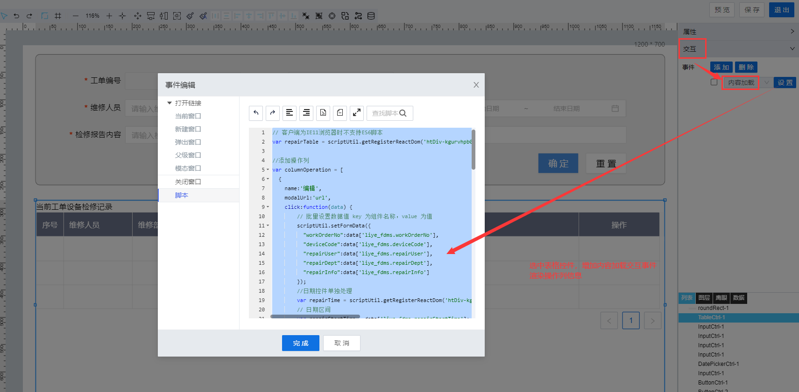

> ## **「工单维修列表--操作列渲染」**

---



---

```JS
// 客户端为IE11浏览器时不支持ES6脚本
var repairTable = scriptUtil.getRegisterReactDom('htDiv-kgurvhpb0-273');

//添加操作列
var columnOperation = [
  {
    name:'编辑',
    modalUrl:'url',
    click:function(data) {
        // 批量设置数据值 key 为组件名称，value 为值
        scriptUtil.setFormData({
          "workOrderNo":data['liye_fdms.workOrderNo'],
          "deviceCode":data['liye_fdms.deviceCode'],
          "repairUser":data['liye_fdms.repairUser'],
          "repairDept":data['liye_fdms.repairDept'],
          "repairInfo":data['liye_fdms.repairInfo']
        });
        //日期控件单独处理
        var repairTime = scriptUtil.getRegisterReactDom('htDiv-kgurvhpb0-312');
        // 日期区间
        var repairStartTime = data['liye_fdms.repairStartTime'];
        var repairEndTime = data['liye_fdms.repairEndTime'];
        repairTime.setValue([repairStartTime,repairEndTime]);
    }
  },
  {
      name:'删除',
      modalUrl:'url',
      click:function(data) {
          var condition = new Object();
          condition.id = data['system.id'];
          var jsonData = JSON.stringify(condition);   
          scriptUtil.request('/project/dam/supngin/api/dam/runtime/liye_fdms/template/deviceRepairRecord/service/system/DeleteDataTableEntries',{
            method: 'POST',
            headers: {
                'X-Namespace': 'liye_fdms'
            },
            body: {
                "condition":jsonData
            }
        }).then(function(res){
          //重新加载列表数据
           repairTable.reloadTableData();
        });
      }
  }
];
repairTable.setColumnOperation(columnOperation);
//初始化执行加载
repairTable.reloadTableData();  
```