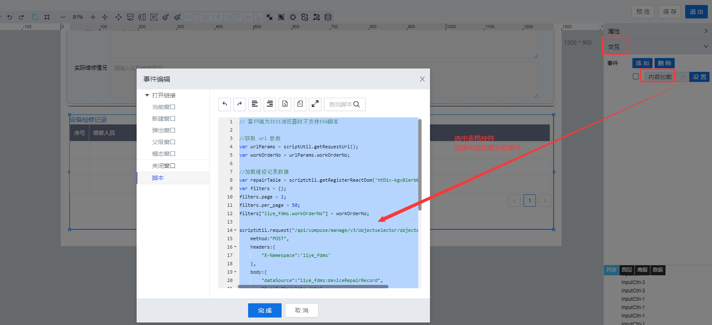

> ## **「工单详情-维修记录初始化」**

---



---

```JS
// 客户端为IE11浏览器时不支持ES6脚本
//获取 url 参数
var urlParams = scriptUtil.getRequestUrl();
var workOrderNo = urlParams.workOrderNo;

//加载维修记录数据
var repairTable = scriptUtil.getRegisterReactDom('htDiv-kgv0lerb0-15935');//获取当前dataTable对象
var filters = {};
filters.page = 1;
filters.per_page = 50;
filters["liye_fdms.workOrderNo"] = workOrderNo;

scriptUtil.request("/api/compose/manage/v3/objectselector/objectdata/query",{
    method:"POST",
    headers:{
        "X-Namespace":'liye_fdms'
    },
    body:{
        "dataSource":"liye_fdms:deviceRepairRecord",
        "type":"template.data",
        "filters":filters
    }
}).then(function(res){
    repairTable.setObjectSource({
        pagination:res.pagination,
        list:res.list.map(item=>({
            "liye_fdms.repairUser":item.liye_fdms_repairuser,
            "liye_fdms.repairDept":item.liye_fdms_repairdept,
            "liye_fdms.repairStartTime":item.liye_fdms_repairstarttime,
            "liye_fdms.repairEndTime":item.liye_fdms_repairendtime,
            "liye_fdms.repairInfo":item.liye_fdms_repairinfo
        }))
    });
});
```