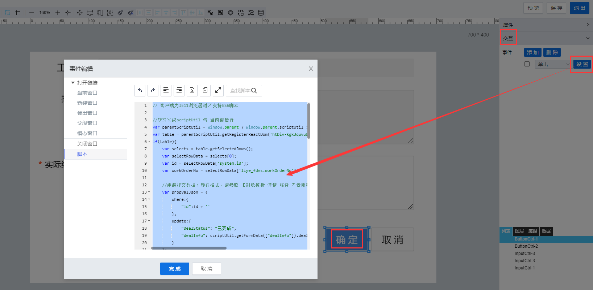

> ## **「关闭点检工单--提交数据」**

---



---

```JS
// 客户端为IE11浏览器时不支持ES6脚本

//获取父级scriptUtil 与 当前编辑行
var parentScriptUtil = window.parent ? window.parent.scriptUtil : scriptUtil;
var table = parentScriptUtil.getRegisterReactDom('htDiv-kgk3quvu0-129');
if(table){
    var selects = table.getSelectedRows();
    var selectRowData = selects[0];
    var id = selectRowData['system.id'];
    var workOrderNo = selectRowData['liye_fdms.workOrderNo'];

    //组装提交数据：参数格式，请参照 【对象模板-详情-服务-内置服务-UpdateDataTableEntry】
    var propValJson = {
        where:{
            "id":id + ''
        },
        update:{
            "dealStatus": "已完成",
            "dealInfo": scriptUtil.getFormData(["dealInfo"]).dealInfo
        }
    };

    scriptUtil.request("/project/dam/supngin/api/dam/runtime/liye_fdms/template/deviceSpotCheck/service/system/UpdateDataTableEntry",{
        method:"POST",
        headers:{
            'X-Namespace': 'liye_fdms'
        },
        body:{
            updateData:JSON.stringify(propValJson)
        }
    }).then(function(res){
        if(res.code != "200" && res.code != "201"){
            scriptUtil.showMessage(res.getMessage(),'error');
        }else{
            //发送待办信息给用户
            sendMsg(workOrderNo);

            scriptUtil.showMessage('已关闭该工单','success');
            //重新加载列表数据
            table.reloadTableData();
            //关闭当前弹出窗
            parentScriptUtil.showModal({ modalVisible: false });
            parentScriptUtil.showMessage("已关闭该工单", "success");
        }
    });
}

//发送待办信息给用户
function sendMsg(workOrderNo){
    var sendInfo = "工单编号为：{workOrderNo}已处理完成，请查阅过程详情！";
    sendInfo = sendInfo.replace(/{workOrderNo}/, workOrderNo);
    var htmlInfo = "<a href='/#/application-runtime/Page_61089c31bee449759c975aa3b1e913b2'>立即跳转>></a>";
    sendInfo = sendInfo.concat(htmlInfo);

    scriptUtil.request('/api/notification/sendNotice',{
        method: 'POST',
        headers: {
            'X-Namespace': 'liye_fdms'
        },
        body: {
            "sender":"test",
            "source": "system",
            "type":"stationLetter",
            "receivers":["check001"],
            "content":{
                "encoding":"UTF-8",
                "title":"已关闭设备检修工单",
                "text":sendInfo,
                "voice": false, //是否为语音消息， true or false
                "type": "html" //站内信消息内容类型，text 纯文本、html 超文本标记语言
            }
        }
    }).then(function(res){
        console.log("result",res);
        if(res.code != "200"){
            scriptUtil.showMessage(res.getMessage(),'error');
        }
    });
}
```