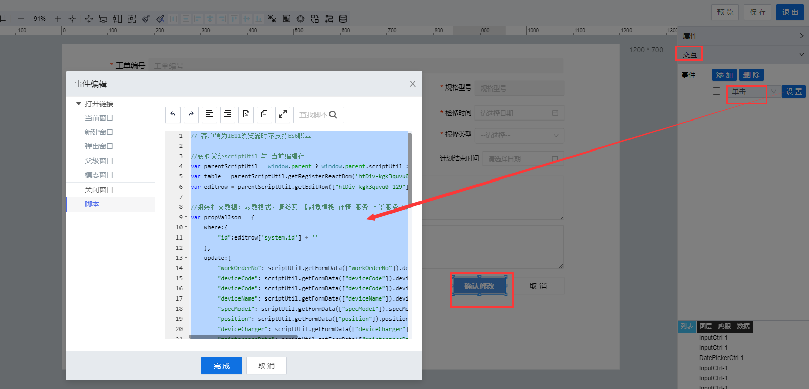

> ## **「编辑点检工单--提交编辑数据」**

---



---

```JS
// 客户端为IE11浏览器时不支持ES6脚本

//获取父级scriptUtil 与 当前编辑行
var parentScriptUtil = window.parent ? window.parent.scriptUtil : scriptUtil;
var table = parentScriptUtil.getRegisterReactDom('htDiv-kgk3quvu0-129');//根据组件id获取当前dataTable对象
var editrow = parentScriptUtil.getEditRow(["htDiv-kgk3quvu0-129"]);//获取当前编辑行记录数据
var dealStatus = editrow['liye_fdms.dealStatus'];//获取处理状态
var updateJson = {};
if(dealStatus){
    switch(dealStatus){
        case '已创建':
            updateJson = {
                "workOrderNo": scriptUtil.getFormData(["workOrderNo"]).deviceCode,
                "deviceCode": scriptUtil.getFormData(["deviceCode"]).deviceCode,
                "deviceCode": scriptUtil.getFormData(["deviceCode"]).deviceCode,
                "deviceName": scriptUtil.getFormData(["deviceName"]).deviceName,
                "specModel": scriptUtil.getFormData(["specModel"]).specModel,
                "position": scriptUtil.getFormData(["position"]).position,
                "deviceCharger": scriptUtil.getFormData(["deviceCharger"]).deviceCharger,
                "maintenanceDate": scriptUtil.getFormData(["maintenanceDate"]).maintenanceDate,
                "repairDept": scriptUtil.getFormData(["repairDept"]).repairDept,
                "repairCharger": scriptUtil.getFormData(["repairCharger"]).repairCharger,
                "repairType": scriptUtil.getFormData(["repairType"]).repairType,
                "submitDate": scriptUtil.getFormData(["submitDate"]).submitDate,
                "plannedStartTime": scriptUtil.getFormData(["plannedStartTime"]).plannedStartTime,
                "plannedEndTime": scriptUtil.getFormData(["plannedEndTime"]).plannedEndTime,
                "repairContent": scriptUtil.getFormData(["repairContent"]).repairContent,
                "dealInfo": scriptUtil.getFormData(["dealInfo"]).dealInfo
            };
            break;
        case '正在处理':
            updateJson = {
                "dealInfo": scriptUtil.getFormData(["dealInfo"]).dealInfo
            };
            break;
        default:
            updateJson = {};
    }
}

//组装提交数据：参数格式，请参照 【对象模板-详情-服务-内置服务-UpdateDataTableEntry】
var propValJson = {
    where:{
        "id":editrow['system.id'] + ''
    },
    update:updateJson
};

scriptUtil.request("/project/dam/supngin/api/dam/runtime/liye_fdms/template/deviceSpotCheck/service/system/UpdateDataTableEntry",{
    method:"POST",
    headers:{
        'X-Namespace': 'liye_fdms'
    },
    body:{
        updateData:JSON.stringify(propValJson)
    }
}).then(function(res){
    if(res.code != "200" && res.code != "201"){
        scriptUtil.showMessage(res.getMessage(),'error');
    }else{
        scriptUtil.showMessage('编辑成功','success');
        //重新加载列表数据
        table.reloadTableData();
        //关闭当前弹出窗
        parentScriptUtil.showModal({ modalVisible: false });
        parentScriptUtil.showMessage("编辑成功", "success");
    }
});
```