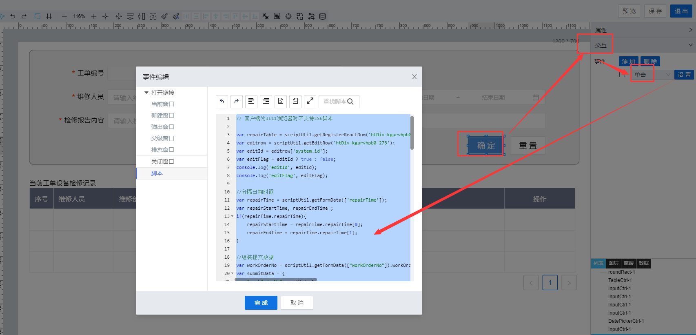

> ## **「工单维修记录--新增/编辑」**

---



---

```JS
// 客户端为IE11浏览器时不支持ES6脚本
var repairTable = scriptUtil.getRegisterReactDom('htDiv-kgurvhpb0-273');
var editrow = scriptUtil.getEditRow('htDiv-kgurvhpb0-273');
var editId = editrow['system.id'];
var editFlag = editId ? true : false;
console.log('editId', editId);
console.log('editFlag', editFlag);

//分隔日期时间
var repairTime = scriptUtil.getFormData(['repairTime']);
var repairStartTime, repairEndTime ;
if(repairTime.repairTime){
    repairStartTime = repairTime.repairTime[0];
    repairEndTime = repairTime.repairTime[1];
}

//组装提交数据
var workOrderNo = scriptUtil.getFormData(["workOrderNo"]).workOrderNo;
var submitData = {
    "workOrderNo": workOrderNo,
    "deviceCode": scriptUtil.getFormData(["deviceCode"]).deviceCode,
    "repairUser": scriptUtil.getFormData(["repairUser"]).repairUser,
    "repairDept": scriptUtil.getFormData(["repairDept"]).repairDept,
    "repairStartTime": repairStartTime,
    "repairEndTime": repairEndTime,
    "repairInfo": scriptUtil.getFormData(["repairInfo"]).repairInfo
};

if(editFlag){
    //编辑提交
    var propValJson = {
        where:{
            "id":editId + ''
        },
        update:submitData
    };
    scriptUtil.request("/project/dam/supngin/api/dam/runtime/liye_fdms/template/deviceRepairRecord/service/system/UpdateDataTableEntry",{
        method:"POST",
        headers:{
            'X-Namespace': 'liye_fdms'
        },
        body:{
            updateData:JSON.stringify(propValJson)
        }
    }).then(function(res){
        if(res.code != "200" && res.code != "201"){
            scriptUtil.showMessage(res.getMessage(),'error');
        }else{
            scriptUtil.showMessage('编辑成功','success');
            //置空输入框信息
            clearInputData();
            //重新加载列表数据
            repairTable.reloadTableData();
        }
    });
    //重置id与flag
    editId = undefined;
    editFlag = false;
}else{
    //新增提交
    scriptUtil.request('/project/dam/supngin/api/dam/runtime/liye_fdms/template/deviceRepairRecord/service/liye_fdms/CreateRepairRecord',{
        method: 'POST',
        headers: {
            'X-Namespace': 'liye_fdms'
        },
        body: submitData
    }).then(function(res){
        if(res.code != "200"){
            scriptUtil.showMessage(res.getMessage(),'error');
        }else{
            scriptUtil.showMessage('新增成功','success');
            //置空输入框信息
            clearInputData();
            //重新加载列表数据
            repairTable.reloadTableData();
        }
    });
    //重置id与flag
    editId = undefined;
    editFlag = false;
}

//置空输入框信息
function clearInputData(){
    scriptUtil.setFormData({
        "repairUser":"",
        "repairDept":"",
        "repairInfo":""
      });
      //日期控件单独处理
      var repairTime = scriptUtil.getRegisterReactDom('htDiv-kgurvhpb0-312');
      // 日期区间
      repairTime.setValue(['','']);
}
```