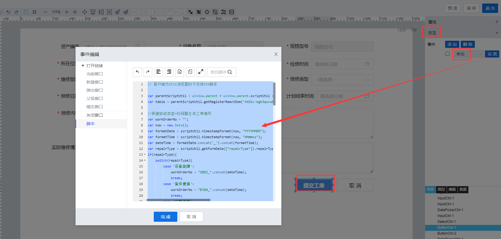

> ## **「创建点检工单」**

---



---

```JS
// 客户端为IE11浏览器时不支持ES6脚本
var parentScriptUtil = window.parent ? window.parent.scriptUtil : scriptUtil;
var table = parentScriptUtil.getRegisterReactDom('htDiv-kgk3quvu0-129');//获取工单列表dataTable对象

//根据报修类型+时间戳生成工单编号
var workOrderNo = "";
var now = new Date();
var formatDate = scriptUtil.timestampFormat(now, "YYYYMMDD");
var formatTime = scriptUtil.timestampFormat(now, "HHmmss");
var dateTime = formatDate.concat('_').concat(formatTime);
var repairType = scriptUtil.getFormData(["repairType"]).repairType;
if(repairType){
    switch(repairType){
        case '设备故障':
            workOrderNo = "SBGZ_".concat(dateTime);
            break;
        case '备件更换':
            workOrderNo = "BJGH_".concat(dateTime);
            break;
        case '定期保养':
            workOrderNo = "DQBY_".concat(dateTime);
            break;
        default:
            workOrderNo = "";
    }
}

//提交检修工单
scriptUtil.request('/project/dam/supngin/api/dam/runtime/liye_fdms/template/deviceSpotCheck/service/liye_fdms/CreateWorkOrder',{
    method: 'POST',
    headers: {
        'X-Namespace': 'liye_fdms'
    },
    body: {
        "workOrderNo": workOrderNo,
        "deviceCode": scriptUtil.getFormData(["deviceCode"]).deviceCode,
        "deviceName": scriptUtil.getFormData(["deviceName"]).deviceName,
        "specModel": scriptUtil.getFormData(["specModel"]).specModel,
        "position": scriptUtil.getFormData(["position"]).position,
        "deviceCharger": scriptUtil.getFormData(["deviceCharger"]).deviceCharger,
        "maintenanceDate": scriptUtil.getFormData(["maintenanceDate"]).maintenanceDate,
        "repairDept": scriptUtil.getFormData(["repairDept"]).repairDept,
        "repairCharger": scriptUtil.getFormData(["repairCharger"]).repairCharger,
        "repairType": scriptUtil.getFormData(["repairType"]).repairType,
        "submitDate": scriptUtil.getFormData(["submitDate"]).submitDate,
        "plannedStartTime": scriptUtil.getFormData(["plannedStartTime"]).plannedStartTime,
        "plannedEndTime": scriptUtil.getFormData(["plannedEndTime"]).plannedEndTime,
        "repairContent": scriptUtil.getFormData(["repairContent"]).repairContent,
        "dealInfo": scriptUtil.getFormData(["dealInfo"]).dealInfo
    }
}).then(function(res){
    if(res.code != "200"){
        scriptUtil.showMessage(res.getMessage(),'error');
    }else{
        //发送待办信息给用户
        sendMsg();

        scriptUtil.showMessage('新增成功','success');
        //重新加载列表数据
        table.reloadTableData();
        //关闭当前弹出窗
        parentScriptUtil.showModal({ modalVisible: false });
        parentScriptUtil.showMessage("新增成功", "success");
    }
});

//发送待办信息给用户
function sendMsg(){
    var sendInfo = "您有一条设备检修工单待处理，工单编号为：{workOrderNo}，请前往处理！";
    sendInfo = sendInfo.replace(/{workOrderNo}/, workOrderNo);
    //组装消息体内容为HTML格式，可以点击跳转
    var htmlInfo = "<a href='/#/application-runtime/Page_61089c31bee449759c975aa3b1e913b2'>立即处理>></a>";
    sendInfo = sendInfo.concat(htmlInfo);

    scriptUtil.request('/api/notification/sendNotice',{
        method: 'POST',
        headers: {
            'X-Namespace': 'liye_fdms'
        },
        body: {
            "sender":"test",
            "source": "system",
            "type":"stationLetter",
            "receivers":["repair001"],
            "content":{
                "encoding":"UTF-8",
                "title":"待处理设备检修工单",
                "text":sendInfo,
                "voice": false, //是否为语音消息， true or false
                "type": "html" //站内信消息内容类型，text 纯文本、html 超文本标记语言
            }
        }
    }).then(function(res){
        console.log("result",res);
        if(res.code != "200"){
            scriptUtil.showMessage(res.getMessage(),'error');
        }
    });
}
```