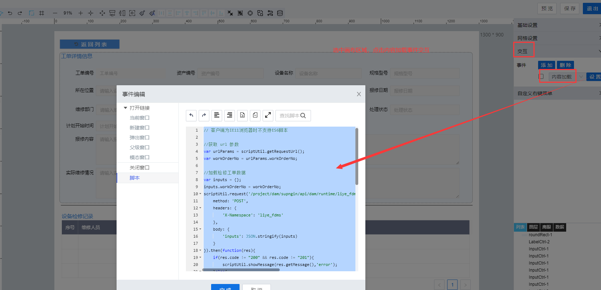

> ## **「工单详情-工单基本信息初始化」**

---



---

```JS
// 客户端为IE11浏览器时不支持ES6脚本
//获取 url 参数
var urlParams = scriptUtil.getRequestUrl();
var workOrderNo = urlParams.workOrderNo;

//加载检修工单数据
var inputs = {};
inputs.workOrderNo = workOrderNo;
scriptUtil.request('/project/dam/supngin/api/dam/runtime/liye_fdms/template/deviceSpotCheck/service/system/getDataTableScript',{
    method: 'POST',
    headers: {
        'X-Namespace': 'liye_fdms'
    },
    body: {
        'inputs': JSON.stringify(inputs)
    }
}).then(function(res){
    if(res.code != "200" && res.code != "201"){
        scriptUtil.showMessage(res.getMessage(),'error');
    }else{
        var dataList = res.data.result.list;
        if(dataList != null && dataList.length > 0){
            dataList.forEach(function(item){
                var _workOrderNo = item.liye_fdms_workorderno;
                if(_workOrderNo == workOrderNo){
                    //为表单页面各个控件赋值
                    scriptUtil.setFormData({
                        "workOrderNo":item.liye_fdms_workorderno,
                        "deviceCode":item.liye_fdms_devicecode,
                        "deviceName":item.liye_fdms_devicename,
                        "specModel":item.liye_fdms_specmodel,
                        "position":item.liye_fdms_position,
                        "deviceCharger":item.liye_fdms_devicecharger,
                        "repairContent":item.liye_fdms_repaircontent,
                        "maintenanceDate":item.liye_fdms_maintenancedate,
                        "dealStatus":item.liye_fdms_dealstatus,
                        "repairCharger":item.liye_fdms_repairdept,
                        "specModel":item.liye_fdms_repaircharger,
                        "dealInfo":item.liye_fdms_dealinfo,
                        "submitDate":item.liye_fdms_submitdate,
                        "plannedStartTime":item.liye_fdms_plannedstarttime,
                        "plannedEndTime":item.liye_fdms_plannedendtime
                    });
                }
            });
        }
    }
});
```