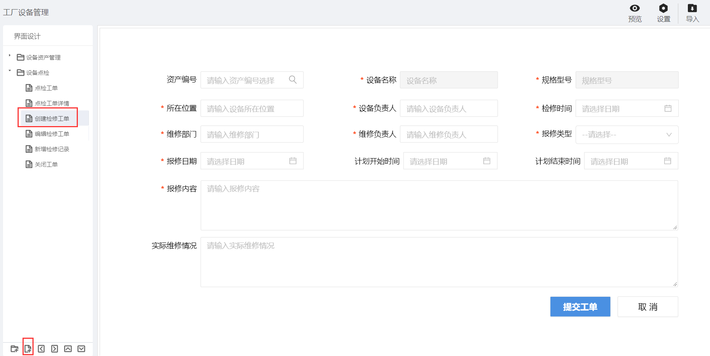
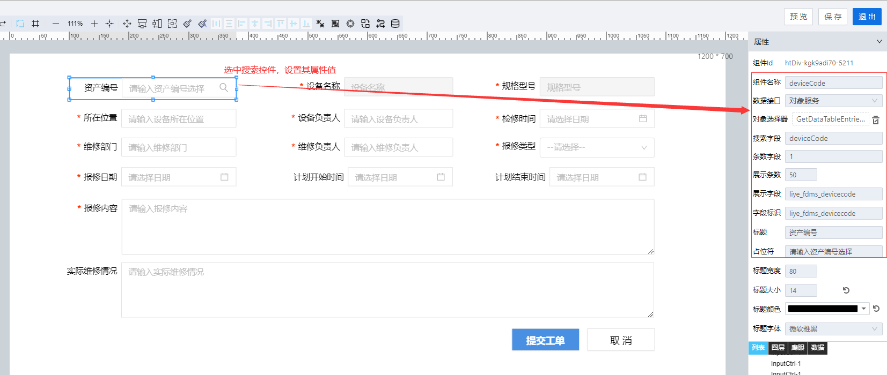

> ## **新增「创建检修工单」页面**

---

- **根据基础操作介绍，新增「创建检修工单」页面；**
- **双击页面空白处，或者点击页面右上角的编辑按钮，进入画布设计器；**

---

> ### **页面功能分析**

---

- 信息创建「**提交工单**」；
  - 填写检修工单信息后，提交信息创建；
  - 发送工单待办信息给检修负责人；
- 「**内容校验**」：必填性校验与数据格式校验；
  - 提交数据时，对必填性字段及对应格式的数据进行格式校验；
- 「**选择设备**」；
  - 输入关键词，输出搜索结果范围内的设备列表，选中某个设备，自动你加载设备名称与规格型号；
- 取消创建「**取消**」；
  - 点击取消按钮，不提交当前信息，且关闭当前模态窗口；

---

> ### **所需控件及关键操作说明**

---

- **主要用到表单库中的：搜索框、输入框、按钮、下拉框、日期控件；**
- **根据UI设计，将对应的控件拖拽到画布上，可打开网格视角调整对齐格式等样式；**
- **设置控件名称** ；
  - **为每一个控件设置控件别名，方便通过别名获取其属性值；**
- **设置「设备名称」「规格型号」为只读属性，不可编辑；**
- **为「状态」下拉框，配置静态数据源**
- **「日期控件」选定指定格式数据**

*表单页面组态大致流可参考：[设备资产APP--页面组态--新增设备](/docs/DeviceInfo/PageDesign/addDevice)*

---

> ### **搜索输入框控件**

---

- **操作步骤：**
  - 「**控件选择**」：选择【表单库-搜索控件】;
  - 「**数据接口**」：选择数据接口为【对象服务】;
    - 对象选择器选择【对象模板-表单模板-内置服务-查询列表数据接口（GetDataTableEntries）】;
  - 「**设置搜索字段**」：deviceCode;
  - 「**设置条数字段**」：转换到接口参数中，对应 page ，设置为 1 ，表示搜索条件：page = 1
  - 「**设置展示条数**」：转换到接口参数中，对应 pageSize，设置为 50，表示搜索条件： pageSize = 50
  - 「**展示字段**」：通过F12查询接口返回参数，可对应到返回的字段参数为：liye_fdms_devicecode。**【组成格式：命名空间+下划线+字段名全小写】**;
  - 「**字段标识**」：接口返回内容对应的字段标识，要求唯一，选中的字段的 value 值，可通过 getItemValue 获取选中的值。

---

> ### 脚本服务示例

---

**选中相应的控件，点击右侧的「交互」属性，为相应的控件绑定「单击」「数据加载」等事件，将对应的脚本服务代码写入，执行服务。**

- **常用服务参考**
  - [常用脚本服务](/docs/DeviceInfo/ObjectService/commonJS)
  - [内置对象服务](https://supos-project.github.io/supOS-Object-Documents/#/docs/ObjectService/Service/)
- **当前页面使用脚本**
  - [设备搜索绑定](/docs/DeviceMaintenance/ObjectService/deviceSearchBind)
  - [提交工单](/docs/DeviceMaintenance/ObjectService/submitWorkOrder)