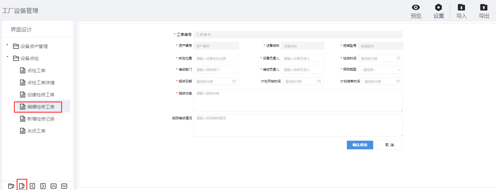

> ## **编辑「检修工单」页面**

---

- **根据基础操作介绍，新增「创建检修工单」页面；**
- **双击页面空白处，或者点击页面右上角的编辑按钮，进入画布设计器；**

---

> ### **页面功能分析**

---

- 「**编辑修改**」；
  - 修改检修工单信息后，提交信息；
- 「**内容校验**」：必填性校验与数据格式校验；
  - 提交数据时，对必填性字段及对应格式的数据进行格式校验；
- 「**基础信息绑定**」；
  - 工单编号、设备信息等字段加载，并设置为只读属性，不可编辑；
- 取消修改「**取消**」；
  - 点击取消按钮，不提交当前信息，且关闭当前模态窗口；

---

> ### **所需控件及关键操作说明**

---

- **主要用到表单库中的：输入框、按钮、下拉框、日期控件；**
- **根据UI设计，将对应的控件拖拽到画布上，可打开网格视角调整对齐格式等样式；**
- **设置控件名称** ；
  - **为每一个控件设置控件别名，方便通过别名获取其属性值；**
- **设置「工单编号」「资产编号」「设备名称」「规格型号」为只读属性，不可编辑；**
- **为下拉框，配置静态数据源**
- **「日期控件」选定指定格式数据**

*表单页面组态大致流可参考：[设备资产APP--页面组态--编辑设备](/docs/DeviceInfo/PageDesign/editDevice)*

---

> ### 脚本服务示例

---

**选中相应的控件，点击右侧的「交互」属性，为相应的控件绑定「单击」「数据加载」等事件，将对应的脚本服务代码写入，执行服务。**

- **常用服务参考**
  - [常用脚本服务](/docs/DeviceInfo/ObjectService/commonJS)
  - [内置对象服务](https://supos-project.github.io/supOS-Object-Documents/#/docs/ObjectService/Service/)
- **当前页面使用脚本**
  - [编辑工单数据初始化](/docs/DeviceMaintenance/ObjectService/editWorkOrderData)
  - [修改工单提交](/docs/DeviceMaintenance/ObjectService/submitEditWorkOrder)