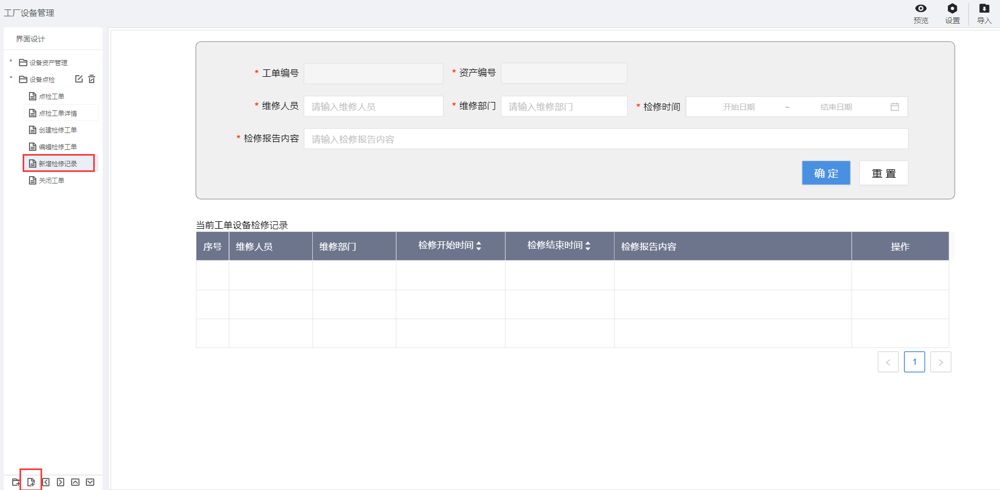

> ## **设置「工单维修记录」页面**

---

- **根据基础操作介绍，新增「新增维修记录」页面；**
- **双击页面空白处，或者点击页面右上角的编辑按钮，进入画布设计器；**

---

> ### **页面功能分析**

---

- 「**数据提交**」
  - 增加维修记录，提交信息；
- 「**内容校验**」：必填性校验与数据格式校验；
  - 提交数据时，对必填性字段及对应格式的数据进行格式校验；
- 「**基础信息绑定**」
  - 工单编号、资产编号等字段加载，并设置为只读属性，不可编辑；
- 「**取消**」
  - 点击取消按钮，置空输入框输入值，重新输入数据处理；
- 「**表格控件**」
  - 「**数据初始化**」：数据加载当前工单下所有的维修记录信息，分页展示；
  - 「**操作列渲染**」：操作列增加编辑与删除操作；
    - 「**操作列-编辑**」：点击编辑按钮，页面上方输入区域，默认加载当前行记录数据，可进行编辑，可提交数据，确认修改后，表格控件；

---

> ### **所需控件及关键操作说明**

---

- **主要用到表单库中的：输入框、按钮、日期控件、表格控件；**
- **根据UI设计，将对应的控件拖拽到画布上，可打开网格视角调整对齐格式等样式；**
- **设置控件名称** ；
  - **为每一个控件设置控件别名，方便通过别名获取其属性值；**
- **设置「工单编号」「资产编号」为只读属性，不可编辑；**
- **「日期控件」选定指定格式数据；**
- **「表格控件」绑定数据源与设置分页；**
  - **「表格控件」设置表头；**
  - **「表格控件」操作列渲染；**

*列表页面组态大致流可参考：[设备资产APP--页面组态--列表页面](/docs/DeviceInfo/PageDesign/pageList)*

*表单页面组态大致流可参考：[设备资产APP--页面组态--编辑设备](/docs/DeviceInfo/PageDesign/editDevice)*

---

> ### 脚本服务示例

---

**选中相应的控件，点击右侧的「交互」属性，为相应的控件绑定「单击」「数据加载」等事件，将对应的脚本服务代码写入，执行服务。**

- **常用服务参考**
  - [常用脚本服务](/docs/DeviceInfo/ObjectService/commonJS)
  - [内置对象服务](https://supos-project.github.io/supOS-Object-Documents/#/docs/ObjectService/Service/)
- **当前页面使用脚本**
  - [维修表单内容加载](/docs/DeviceMaintenance/ObjectService/recordRepairData)
  - [新增/编辑维修记录](/docs/DeviceMaintenance/ObjectService/submitRecordRepair)
  - [重置维修记录](/docs/DeviceMaintenance/ObjectService/cancelRecordRepair)
  - [维修记录列表](/docs/DeviceMaintenance/ObjectService/recordRepairList)
  - [维修记录表格操作列渲染](/docs/DeviceMaintenance/ObjectService/recordRepairOperation)