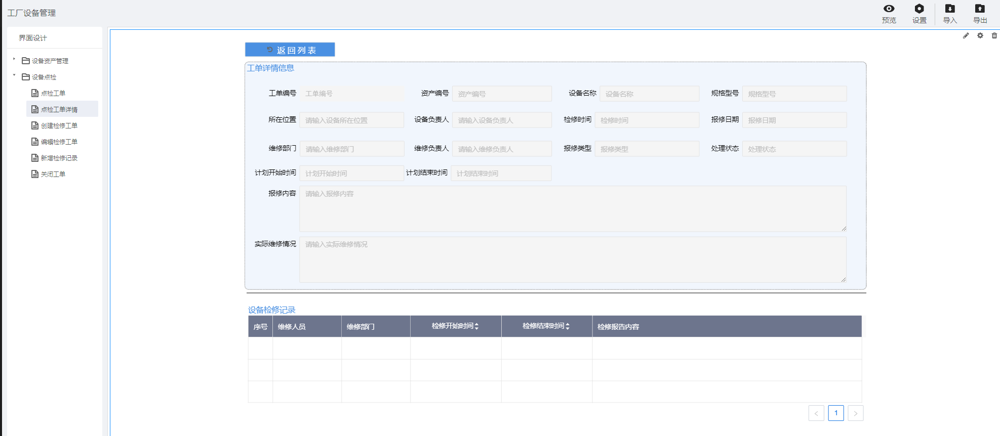

> ## **工单详情**

---

> ### **新增「点检工单详情」页面** 

---

- **根据基础操作介绍，新增「点检工单详情」页面；**
- **双击页面空白处，或者点击页面右上角的编辑按钮，进入画布设计器；**

---

> ### **页面功能分析** 

---

- 点检工单「**基本信息**」；
  - 展示创建工单时填写的基础信息；
- 点检工单「**维修记录**」；
  - 展示当前工单下所有针对该设备的检修记录数据；
- 「**返回列表**」；
  - 点击该按钮，返回列表页面；

---

> ### **所需控件及关键操作说明**

---

- **主要用到表单库中的：输入框、按钮、下拉框、日期控件、表格；**
- **根据UI设计，将对应的控件拖拽到画布上，可打开网格视角调整对齐格式等样式；**
- **设置控件名称** ；
  - **为每一个控件设置控件别名，方便通过别名获取其属性值；**
- **为「状态」下拉框，配置静态数据源**
- **「日期列」显示指定格式数据**
  - **选中对应的操作列，点击编辑，选择对应的日期格式数据类型**
- **「表格控件」绑定数据源与设置分页**
  - **「表格控件」设置表头**

*列表页面组态大致流可参考：[设备资产APP--页面组态--列表页面](/docs/DeviceInfo/PageDesign/pageList)*

*表单页面组态大致流可参考：[设备资产APP--页面组态--新增设备](/docs/DeviceInfo/PageDesign/addDevice)*

---

> ### 脚本服务示例

---

**选中相应的控件，点击右侧的「交互」属性，为相应的控件绑定「单击」「数据加载」等事件，将对应的脚本服务代码写入，执行服务。**

- **常用服务参考**
  - [常用脚本服务](/docs/DeviceInfo/ObjectService/commonJS)
  - [内置对象服务](https://supos-project.github.io/supOS-Object-Documents/#/docs/ObjectService/Service/)
- **当前页面使用脚本**
  - [工单信息初始化](/docs/DeviceMaintenance/ObjectService/workOrderBase)
  - [维修记录初始化](/docs/DeviceMaintenance/ObjectService/repairRecordList)