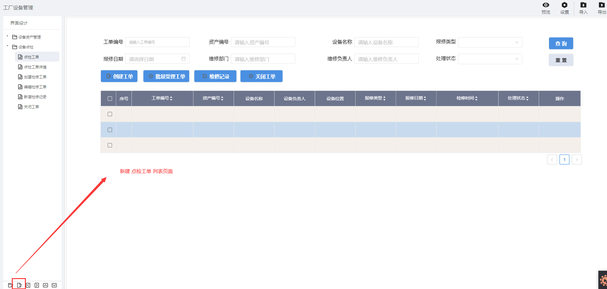

> ## **工单列表**

---

> ### **新增「**资产设备管理**」页面** 

---

- **根据基础操作介绍，新增「点检工单」页面；**
- **双击页面空白处，或者点击页面右上角的编辑按钮，进入画布设计器；**

---

> ### **页面功能分析** 

---

- 搜索「**条件查询**」；
  - 根据工单编号、资产编号、设备名称、保修类型、报修日期、维修部门、维修负责人、处理状态查询点检工单信息；
- 搜索「**条件重置**」；
  - 重置查询条件；
- 点检工单列表「**数据初始化**」：分页展示；
  - 页面刚进来时需要加载已有的数据；
  - 分页进行展示；
- 操作列渲染：「**编辑**」和「**删除**」；
  - 行记录右侧增加操作属性，可根据id编辑与删除相应的记录信息；
- 「**创建工单**」；
  - 点击该按钮，为设备增加新的点检工单记录；
- 「**批量受理工单**」；
  - 选中多条已创建的工单记录，批量受理，将工单状态变更为正在处理；
- 「**维修记录**」；
  - 选中一条正在处理中的工单记录，点击该按钮，为当前工单新增或维护检修记录；
- 「**关闭工单**」；
  - 选中一条正在处理中的工单记录，点击该按钮，确认实际维修情况后，关闭该工单，结束设备点检维修记录；

---

> ### **所需控件及关键操作说明**

---

- **主要用到表单库中的：输入框、按钮、下拉框、日期控件、表格；**
- **根据UI设计，将对应的控件拖拽到画布上，可打开网格视角调整对齐格式等样式；**
- **设置控件名称** ；
  - **为每一个控件设置控件别名，方便通过别名获取其属性值；**
- **为「状态」下拉框，配置静态数据源**
- **「日期列」显示指定格式数据**
  - **选中对应的操作列，点击编辑，选择对应的日期格式数据类型**
- **「表格控件」绑定数据源与设置分页**
  - **「表格控件」设置表头**

*组态大致流可参考：[设备资产APP--页面组态--列表页面](/docs/DeviceInfo/PageDesign/pageList)*

---

> ### 脚本服务示例

---

**选中相应的控件，点击右侧的「交互」属性，为相应的控件绑定「单击」「数据加载」等事件，将对应的脚本服务代码写入，执行服务。**

- **常用服务参考**
  - [常用脚本服务](/docs/DeviceInfo/ObjectService/commonJS)
  - [内置对象服务](https://supos-project.github.io/supOS-Object-Documents/#/docs/ObjectService/Service/)
- **当前页面使用脚本**
  - [条件查询](/docs/DeviceMaintenance/ObjectService/buttonSearch)
  - [查询重置](/docs/DeviceMaintenance/ObjectService/buttonReset)
  - [DataTable操作列渲染](/docs/DeviceMaintenance/ObjectService/dataTableOperation)
  - [DataTable工单编号列渲染](/docs/DeviceMaintenance/ObjectService/dataTableDetail)
  - [批量受理工单](/docs/DeviceMaintenance/ObjectService/buttonBatchDeal)
  - [维修记录](/docs/DeviceMaintenance/ObjectService/buttonRepair)
  - [关闭工单](/docs/DeviceMaintenance/ObjectService/buttonClose)