> ## **设备点检维修 Demo APP 展示**

---

**设备点检维修主要包含以下页面功能：**
- 工单列表
  - CURD(增删改查)
  - 查看详情
- 受理工单
- 维修记录维护
  - CURD(增删改查)
- 关闭工单
- 工单待办通知
- 工单已完成通知

---

> ### **设备点检工单记录列表**

---

**当前页面展示经过巡检人员检测后，创建的检修工单数据列表。**

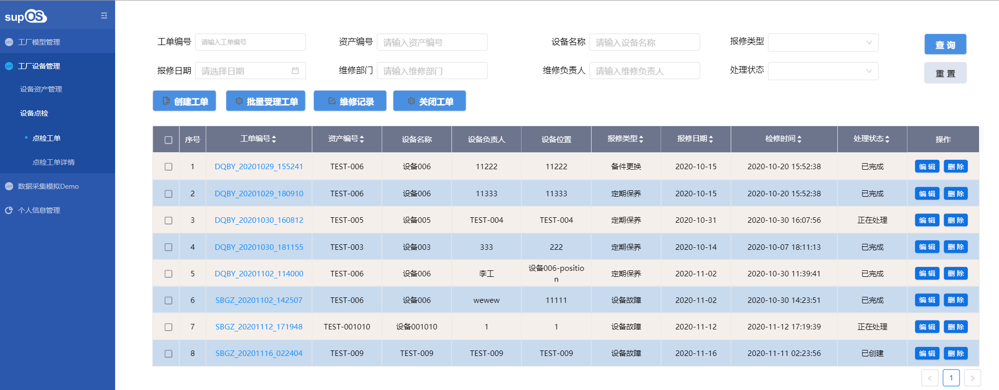

---

> ### **新增点检工单**

---

**点击页面上方的「+ 新增」按钮，弹出添加设备点检工单页面，填写相应信息，点击「确认」按钮，完成新增。**

**新增工单页面，可选择之前设备台账中增加的设备记录数据。**

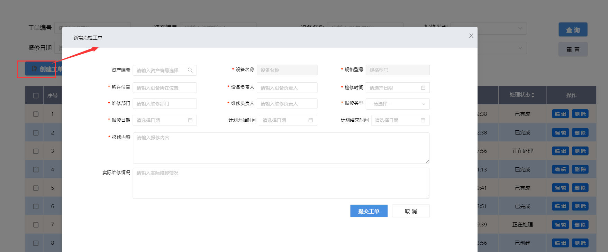

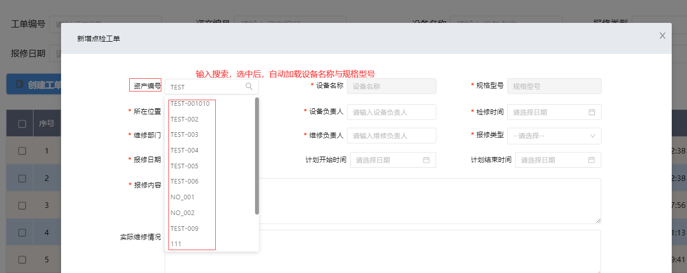

---

> ### **查看详情数据**

---

**点击行记录中的「工单编号」，跳转页面，展示当前工单所对应的工单记录数据、检修记录数据信息。**

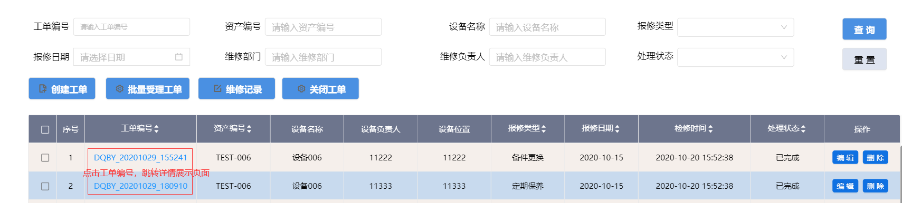

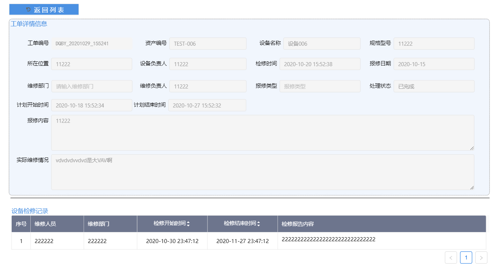

---

> ### **编辑点检工单**

---

**点击行记录右侧的「编辑」按钮，弹出编辑当前行记录设备点检工单信息页面，修改相应信息，点击「确认」按钮，完成编辑操作。**

「**提示**」：其中，处于「正在处理中」、「已完成」状态下的工单记录信息，只能查看详情，不能进行操作编辑。

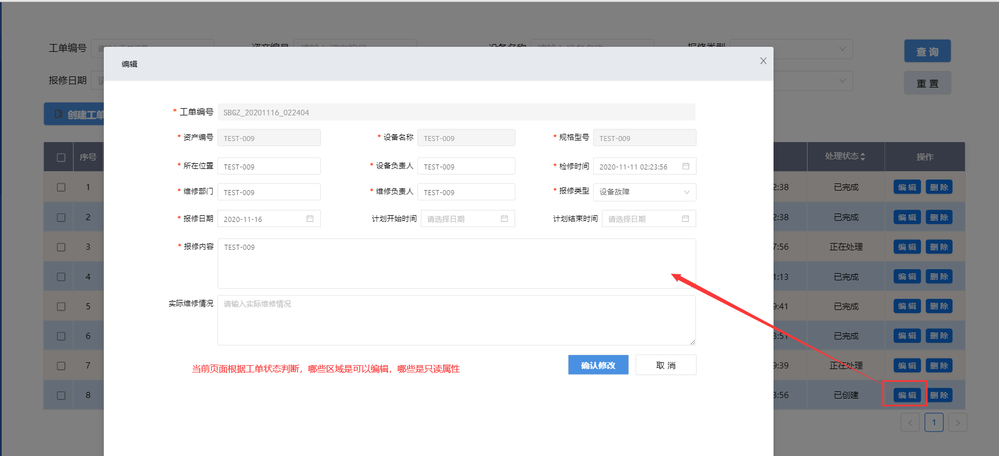

---

> ### **删除点检工单**

---

**点击行记录右侧的「删除」按钮，在弹出窗中选择「确认」按钮，完成删除工单记录操作。**

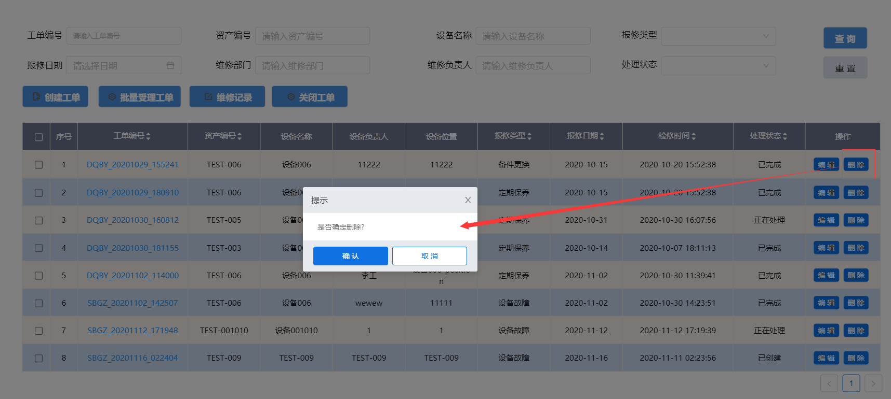

---

> ### **批量受理工单**

---

**选择行记录左侧的复选框，处于「已创建」状态下的工单记录，可由检修人员批量受理，变更为「正在处理中」。**

---

「注意」 
只能同时选择「已创建」状态下的工单记录; 
可批量选择设置。 

---

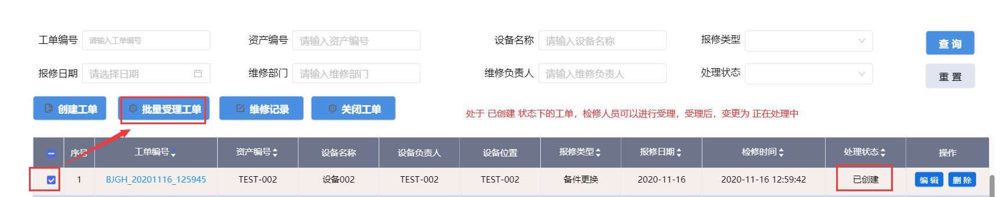

---

> ### **新增维修记录**

---

- **选择行记录左侧的复选框，处于「正在处理中」状态下的工单记录，可由检修人员针对当前工单，增加维修记录。**
- **维修记录操作**
  - 「**列表展示**」：页面下方区域展示针对当前工单的所有设备检修记录；
  - 「**新增检修记录**」：页面上方，填入相应的检修信息，点击确定按钮后，新增一条检修记录；
  - 「**编辑检修记录**」：点击列表右侧的编辑按钮，上面区域自动加载当前行记录数据，可进行修改，点击确定按钮后，编辑完成，下面行记录信息变更；
  - 「**删除检修记录**」：点击列表右侧的删除按钮，弹出框确认后，删除当前行检修记录数据；

---

「注意」 
只能选择一条工单数据进行检修记录维护; 
只能选择「正在处理中」状态下的工单记录； 

---

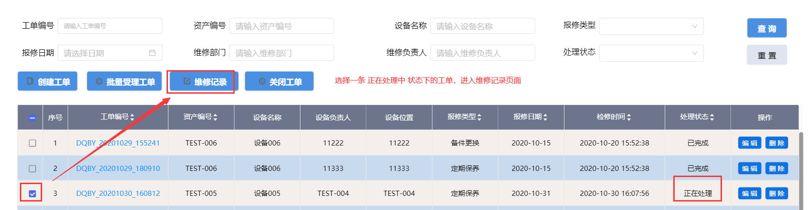

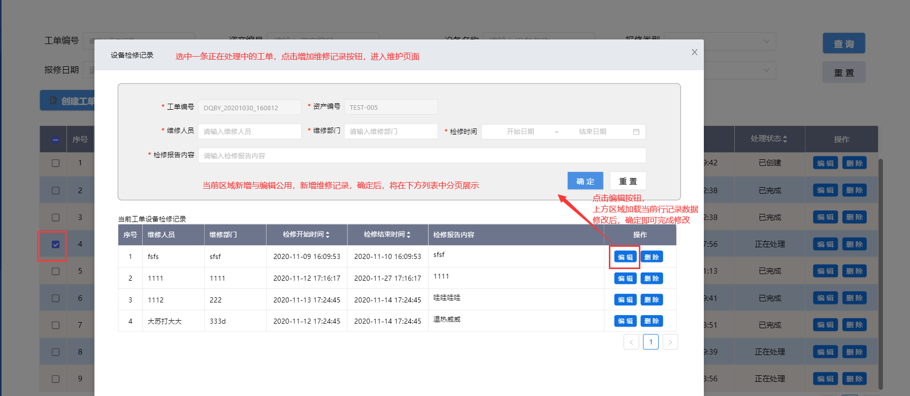

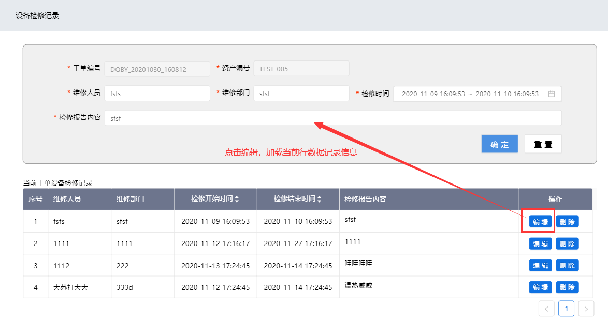

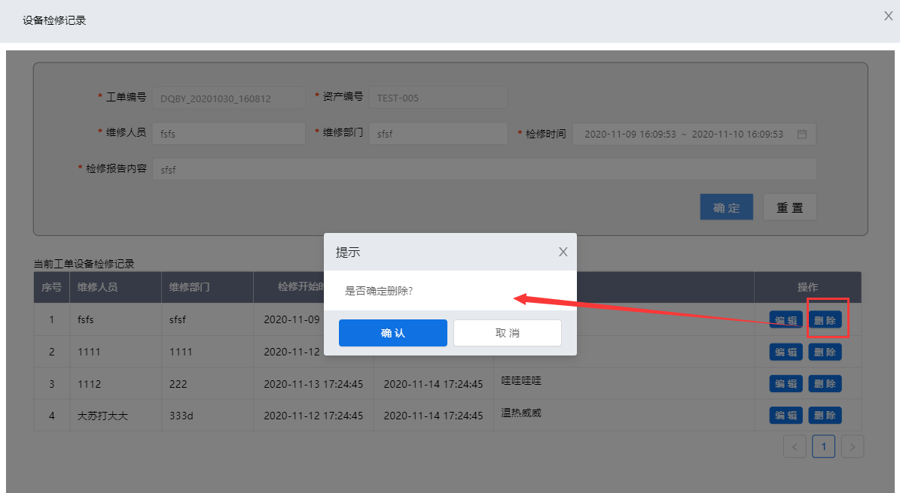

---

> ### **关闭工单**

---

**选择行记录左侧的复选框，处于「正在处理中」状态下的工单记录，可由检修人员在确认已完成对当前设备的检修后，填写实际维修情况后关闭工单，变更为「已完成」。**

---

「注意」 
只能选择「正在处理中」状态下的工单记录进行关闭工单操作； 
只能选择一条工单记录数据进行操作; 

---

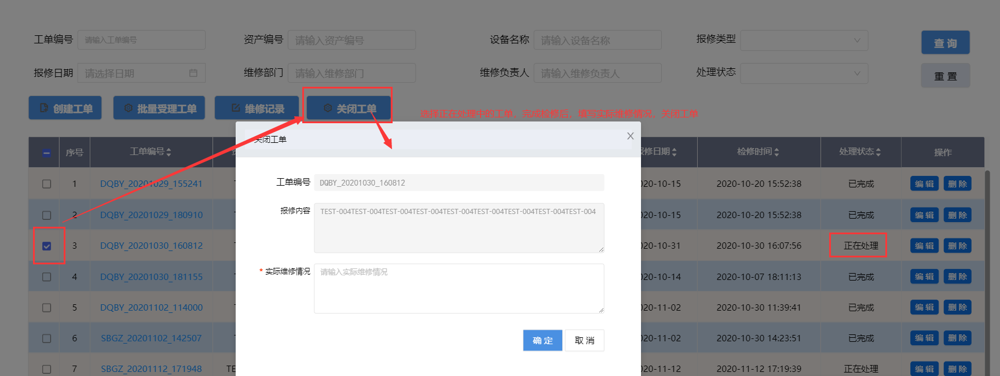

---

> ### **工单待办通知**

---

- **点检人员创建工单后，可发送待办通知给对应的检修人员，提醒负责人及时维修设备，提升设备使用率与安全性。**
- 信息通知形式：
  - 「**警铃通知**」：在页面左下角，小铃铛展示待办信息条数；
  - 「**气泡信息**」：在页面右下角，弹出气泡信息，展示待办列表；
  - 「**站内信**」：站内信通知中心页面，展示所有接收的站内信列表；

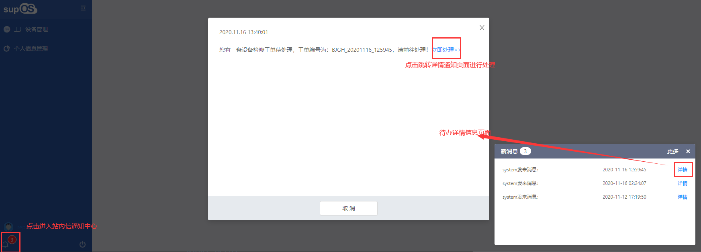

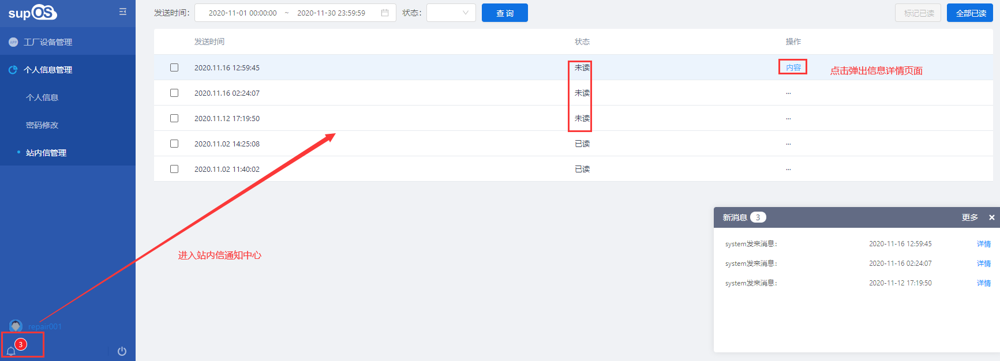

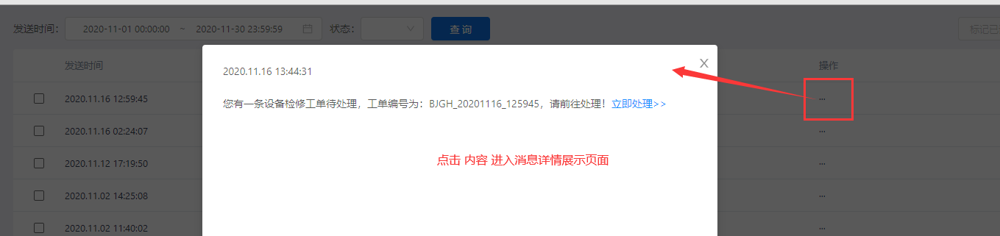

---

> ### **工单已完成通知**

---

**当检修人员针对当前工单记录设备完成所有的维修确认操作后，关闭工单，给创建该工单的点检人员发送已完成通知，及时提醒点检人员复核。**

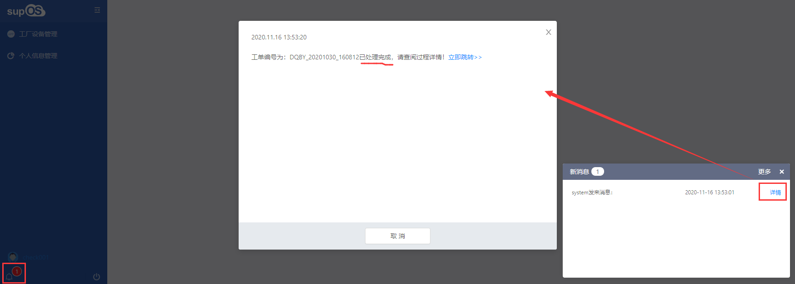