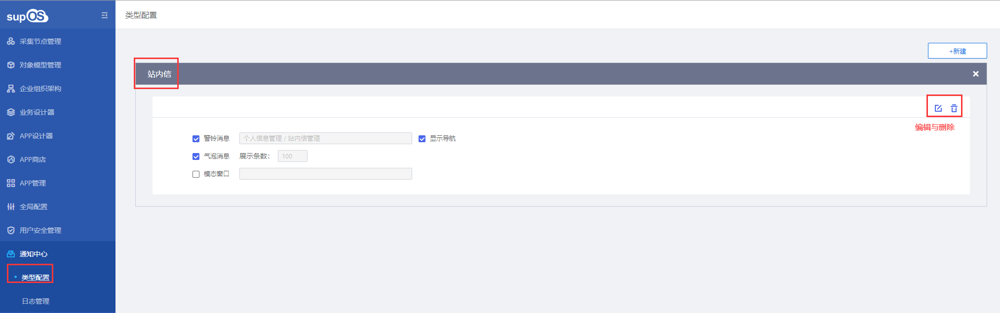
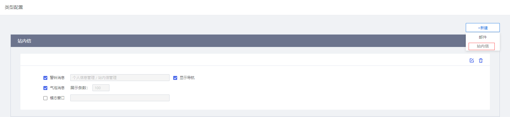
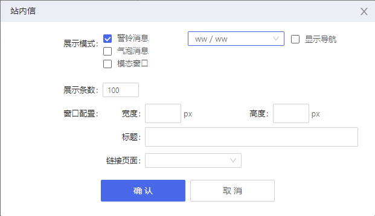
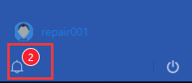
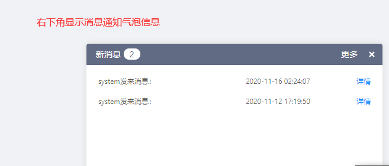
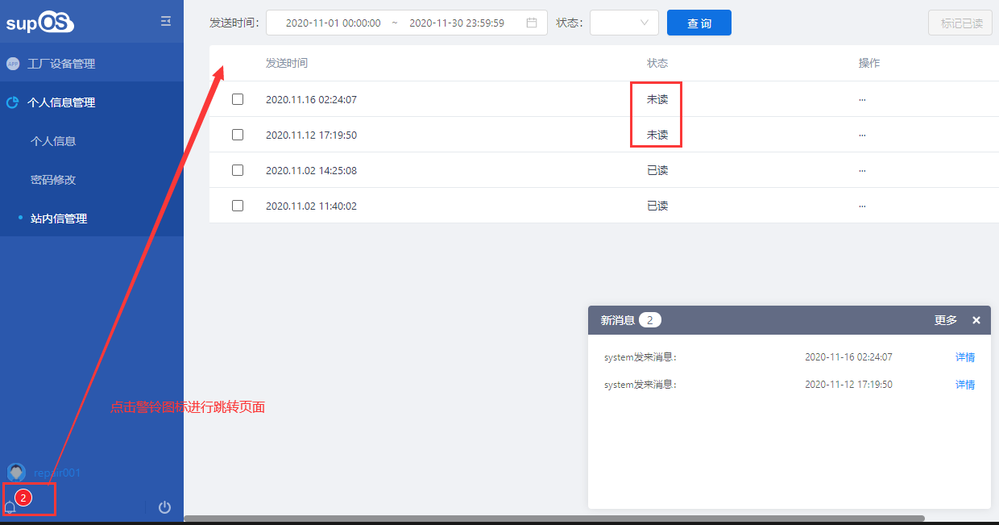

> ## **站内信配置**

---

---

> ## **新增站内信配置**

---

- **点击菜单「**通知中心 --- 类型配置**」，点击「**新建/站内信**」按钮；**

  

- **在弹出「站内信」对话框选择站内信配置信息；**

  

  - 「**展示模式**」：警铃消息、气泡消息、模态窗口，可选择一个或多个展示模式，消息同步；
    - 「**警铃消息**」：在用户界面新增警铃图标，当消息发送时警铃显示未读消息数字；

    

    - 「**气泡消息**」：在页面右下角弹出消息对话框；
      - 「**展示条数**」：气泡消息的展示条数，默认为100条，最大为500条；

    

    - 「**模态窗口**」：通过弹出窗口显示链接页面；
      - 「**窗口配置**」：设置模态窗口的宽度、高度、窗口标题以及链接的页面；

  - 「**选择界面**」：设置点击警铃图标链接到的默认界面；

  

  - 「**显示导航**」：显示链接界面时是否显示系统导航菜单；
- **点击「确定」按钮，新增用户完成；**