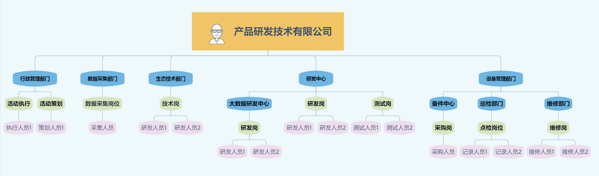

> ## **组织管理**

---

**企业组织架构是supOS凭条用于描述企业人力资源关系和运营管理架构的功能，包括部门管理、岗位管理、人员管理，帮助企业快速搭建组织结构和人员管理。**

---

「注意」--关联关系 
「**人员与岗位**」一个人员可关联多个岗位； 
「**人员与主岗**」一个人员只能关联一个主岗； 
「**人员与部门**」一个人员只能关联一个部门； 
「**部门与主岗**」一个部门只能关联一个主岗； 

---

---

* [部门管理](/docs/Organization/deptMana)
* [岗位管理](/docs/Organization/postMana)
* [人员管理](/docs/Organization/userMana)