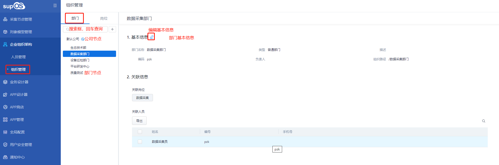
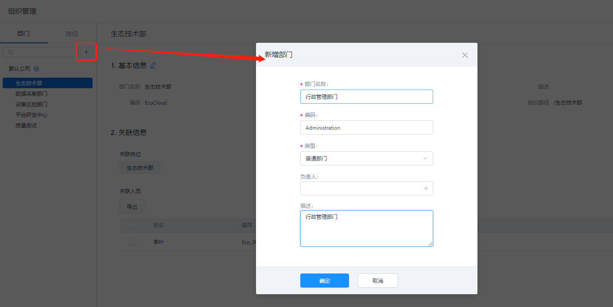
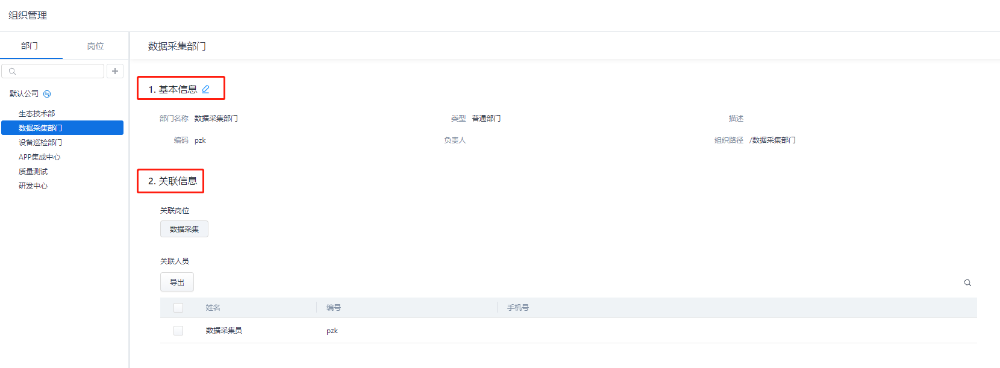
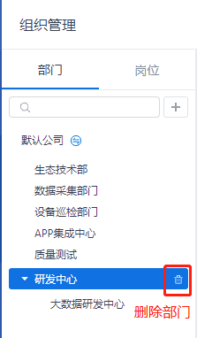
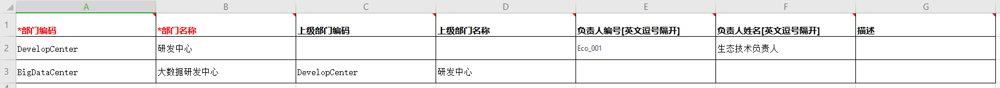
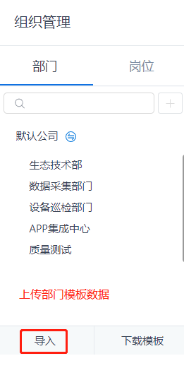
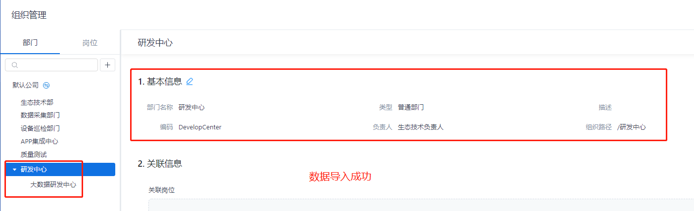

> ## **部门管理**

---

---

> ### **新建部门**

---

**新增部门组织结构，部门结构下关联岗位与人员，部门负责人为部门关联人员的直属领导。**

- **选择公司节点或子节点，点击搜索框旁边的      按钮，在选中的节点下新增子节点；**
- **输入部门节点详情信息；**
  - 「**部门名称**」：对部门进行命名；
  - 「**部门编码**」：用于组织唯一标识，一经确认**不可**根据组织信息自行修改；
  - 「**部门类型**」：可选择「普通部门」或「应急部门」；
  - 「**负责人**」：该部门的负责人，负责人为该部门所有人员的直属领导，负责人从人员列表中进行选择；
  - 「**描述**」：对部门进行描述信息编辑；
  
- **点击「确定」按钮，新增部门完成；**

---

> ### **部门信息**

---

**部门新增成功后，将显示部门基本信息与关联信息，包含：关联岗位、关联人员。**

其中：
- 「**关联岗位**」详见 [岗位管理](/docs/Organization/postMana.md)
- 「**关联人员**」详见 [人员管理](/docs/Organization/userMana.md)

---

> ### **调整部门**

---

- **调整部门显示位置**
  - 选中子节点，上下移动，即可改变部门显示位置

- **调整部门级别**
  - 选中子节点，将其拖动到另外一个子节点上，可以将两个节点关联为上下级部门；

---

> ### **删除部门**

---

**点击部门名称后的      按钮可以删除部门。**

---

「注意」 
组织关联了人员不允许删除。请在删除部门前，删除其关联人员。

---

---

> ### **导入部门**

---

- **点击部门树下方的「**下载模板**」，下载部门导入模板；**

---

---

- **根据格式填写模板信息；**

---

|字段名称|是否必填|说明|
|:---|:---|:---|
|部门名称|是|长度不可以超过50|
|部门编码|是|长度不可以超过200|
|上级部门编码|否|上级部门不传时则是第一级部门； 如果要在其他部门下创建部门则必须传上级部门，可以只填写上级部门名称; 当有重复时，提示用户填写上级部门编码; 如果二者都填了，以编码为准。|
|上级部门名称|否|同上|
|负责人编码|否|可填写多个，以英文逗号隔开，导入时以编码为准|
|负责人名称|否|可填写多个，以英文逗号隔开，导入时以编码为准|
|描述|否|描述长度不可以超过500|

---

---

- **点击部门树下方的「**导入**」，导入部门模板数据；**

---

