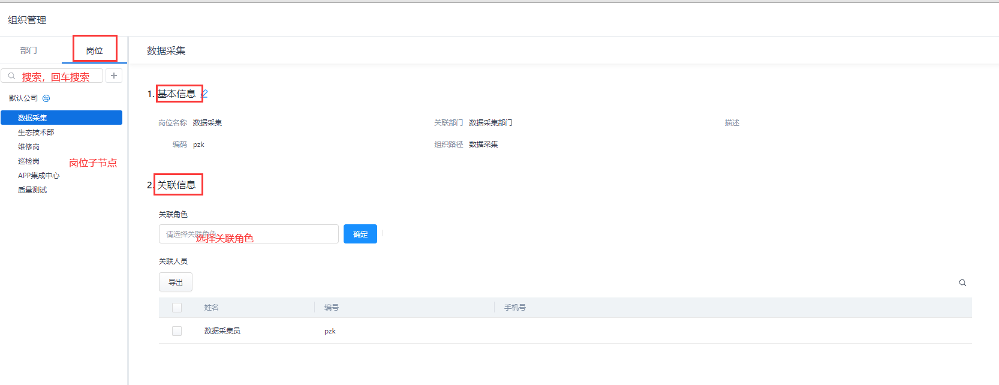
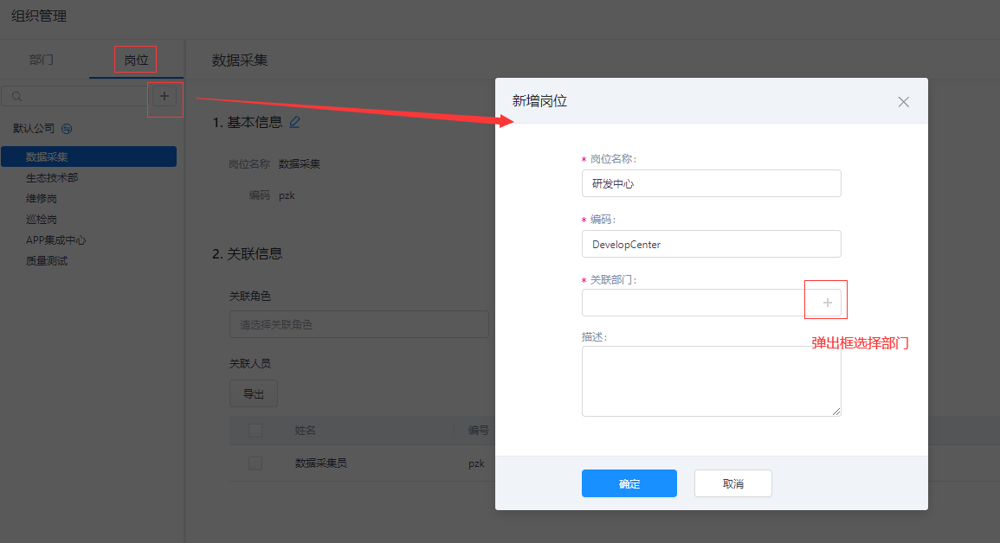
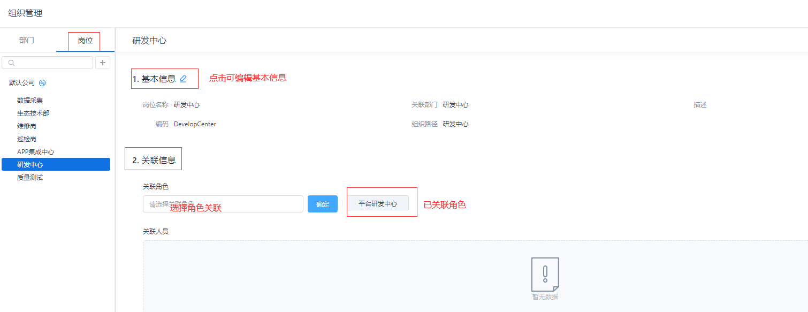
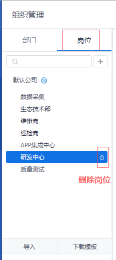
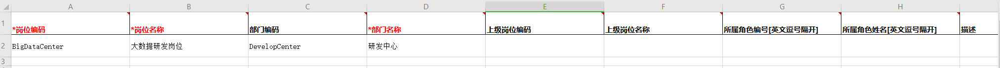
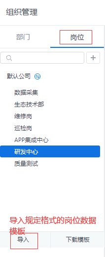
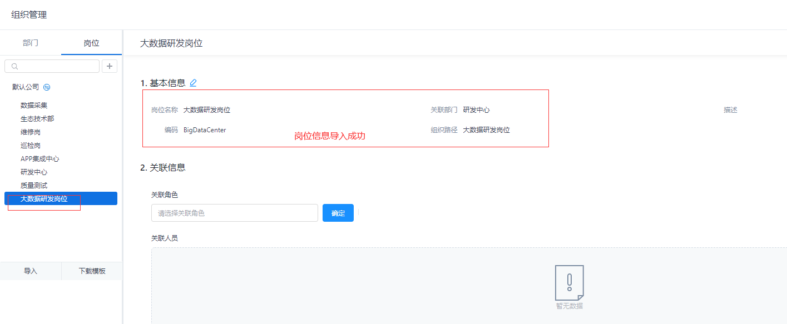

> ## **岗位管理**

---

---

> ### **新建岗位**

---

**新增岗位结构，其结构下关联角色与人员。**

- **选择公司节点或子节点，点击搜索框旁边的      按钮，在选中的节点下新增子节点；**
- **输入部门节点详情信息；**
  - 「**岗位名称**」：对岗位进行命名；
  - 「**岗位编码**」：用于岗位唯一标识，一经确认**不可**根据岗位信息自行修改；
  - 「**关联部门**」：可选择已创建的部门信息；
  - 「**描述**」：对岗位进行描述信息编辑；
  
- **点击「确定」按钮，新增岗位完成；**

---

> ### **岗位信息**

---

**岗位新增成功后，将显示岗位基本信息与关联信息，包含：关联角色、关联人员。**

其中：
- 「**关联角色**」详见 [角色管理](/docs/RoleInfo/roleMana.md)
- 「**关联人员**」详见 [人员管理](/docs/Organization/userMana.md)

---

> ### **调整岗位**

---

- **调整岗位显示位置**
  - 选中子节点，上下移动，即可改变岗位显示位置

- **调整岗位级别**
  - 选中子节点，将其拖动到另外一个子节点上，可以将两个节点关联为上下级岗位；

---

> ### **删除岗位**

---

**点击岗位名称后的      按钮可以删除部。**

---

「注意」 
岗位关联了人员不允许删除。请在删除岗位前，删除/取消其关联人员。

---

---

> ### **导入岗位**

---

- **点击岗位树下方的「**下载模板**」，下载岗位导入模板；**

---

---

- **根据格式填写模板信息；**

---

|字段名称|是否必填|说明|
|:---|:---|:---|
|岗位名称|是|长度不可以超过200|
|岗位编码|是|长度不可以超过50|
|部门名称|是|只允许填写已存在的部门； 如果部门名称存在重复，需要提示用户，该部门名存在重复请填写部门编码|
|部门编码|否|当部门名称存在重复时必须填写； 如果部门编码和名称都填写了，以部门编码的为准|
|上级部门|否|上级部门不传时则是第一级部门； 如果要在其他部门下创建部门则必须传上级部门，可以只填写上级部门名称; 当有重复时，提示用户填写上级部门编码; 如果二者都填了，以编码为准。|
|所属角色编码|否|可填写多个，以英文逗号隔开，导入时以编码为准|
|所属角色名称|否|可填写多个，以英文逗号隔开|
|负责人编码|否|可填写多个，以英文逗号隔开，导入时以编码为准|
|负责人名称|否|可填写多个，以英文逗号隔开，导入时以编码为准|
|上级岗位编码|否|不传时，则为第一级岗位； 如果需要在其他岗位下创建岗位，则必须填上级岗位编码或名称； 填写了编码以编码为准，如果只填写了名称，当有重复的时候，需要提醒用户该上级岗位名称存在重复，请填写上级岗位的编码|
|上级岗位名称|否|同上|
|描述|否|描述长度不可以超过500|

---

---

- **点击岗位树下方的「**导入**」，导入岗位模板数据；**

---

